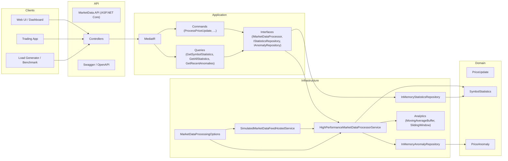
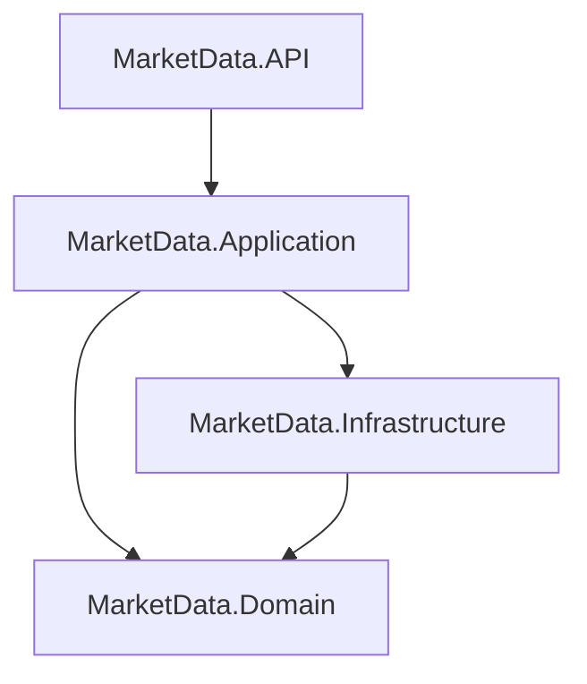
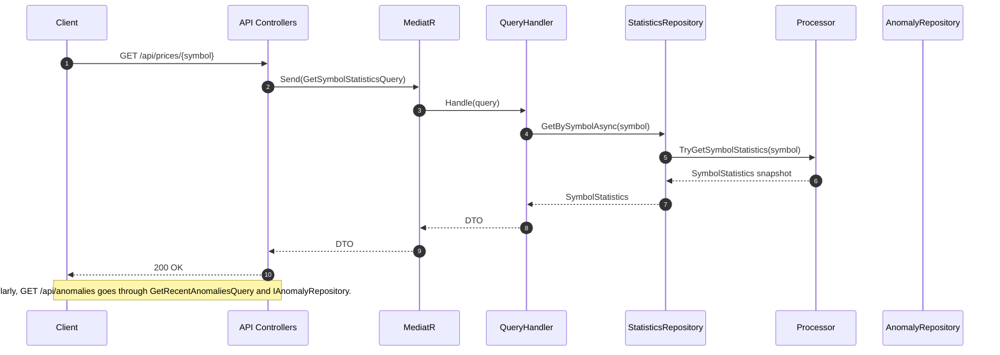
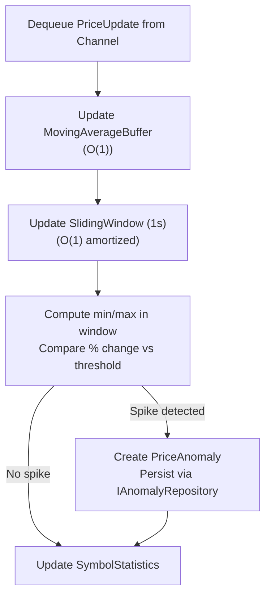
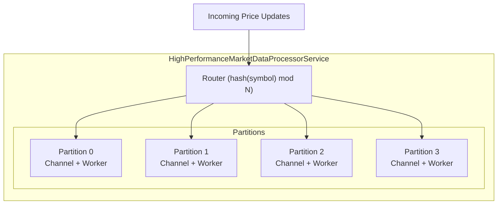
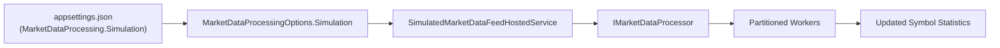
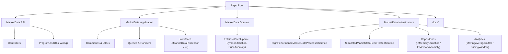
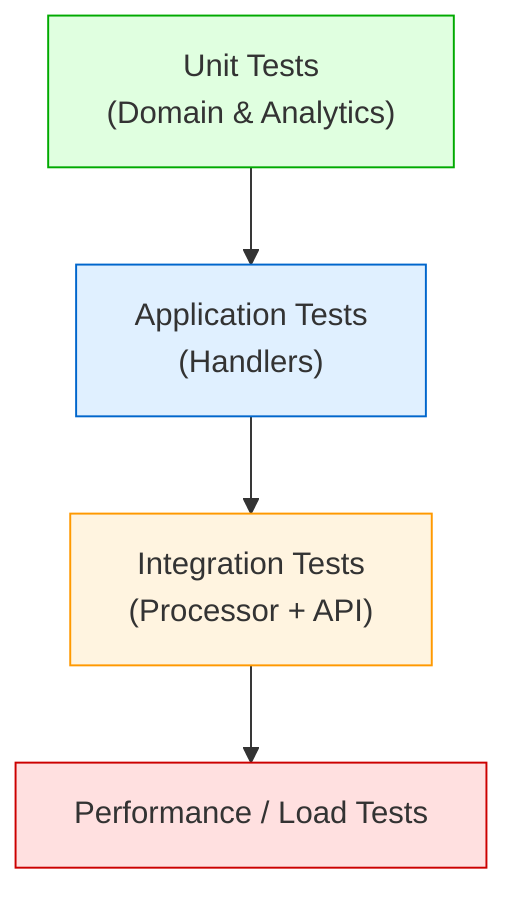
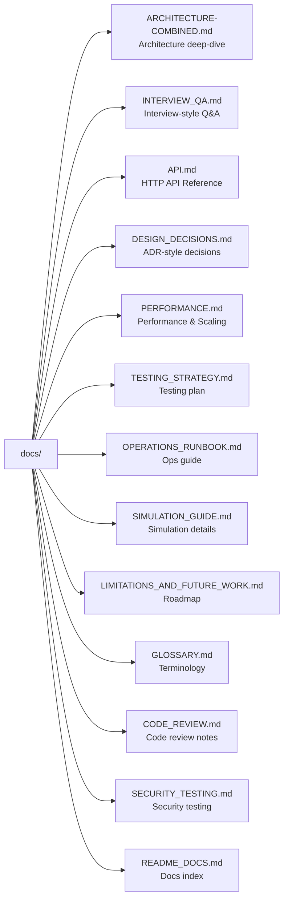

# MarketDataSystem – Real-Time Market Data Processing Platform

> **Goal:** Demonstrate senior-level skills in **system design, high-throughput processing, concurrency, observability, and clean architecture** using .NET.

This repository implements a **real-time market data engine** that:

- Consumes **high-frequency price updates** (ticks) for multiple symbols.
- Maintains **per-symbol moving averages** over the last _N_ prices.
- Detects **price anomalies** (spikes greater than a configurable percent within a 1‑second window).
- Exposes current state and metrics over a **clean HTTP API**.
- Includes a configurable **simulation feed** so you can demo and load-test the pipeline without any external dependency.
- Is backed by a very detailed `docs/` folder (architecture, design decisions, performance, testing, security, code review, and more).

---

## 1. System Overview

The MarketDataSystem is deliberately built as a **small but realistic** streaming backend:

- Similar in spirit to a **market data / telemetry microservice**.
- Optimized for **throughput, correctness, and clarity**.
- Structured for **easy reasoning and explanation in interviews**.

**Key requirements satisfied:**

- ✅ Simulate market data feed with random price updates for multiple symbols.  
- ✅ Maintain a moving average of the **latest N updates per symbol**.  
- ✅ Detect **> 2% spikes** within any **1‑second interval** (configurable).  
- ✅ Sustain **10,000+ updates/second** on a single node (design target).  
- ✅ Use **concurrent patterns** (channels, tasks, async/await) safely.

---

## 2. Architecture

### 2.1 High-Level View



### 2.2 Layered Design



- **API** depends on **Application**.
- **Application** depends on **Domain** (and defines interfaces).  
- **Infrastructure** depends on **Application** and **Domain** (and provides implementations).  
- **Domain** is pure and does not depend on any other project.

### 2.3 Component Responsibilities

| Component                                 | Role / Responsibility                                                       |
|-------------------------------------------|-----------------------------------------------------------------------------|
| `HighPerformanceMarketDataProcessorService` | Real-time ingestion & processing core (partitioned workers, channels).      |
| `SimulatedMarketDataFeedHostedService`   | Generates random-walk prices for configured symbols.                        |
| `MovingAverageBuffer`                    | O(1) moving average over last N prices (ring buffer + running sum).        |
| `SlidingWindow`                           | O(1) amortized min/max over a 1‑second window (monotonic deques).          |
| `SymbolStatistics`                       | Aggregated state per symbol (current price, MA, min, max, count, lastTime).|
| `PriceAnomaly`                           | Represents a detected spike (> threshold within window).                    |
| `InMemoryStatisticsRepository`           | Adapts processor state to query DTOs.                                       |
| `InMemoryAnomalyRepository`              | Keeps a bounded, in-memory list of recent anomalies.                        |
| Commands & Queries (Application)         | Orchestrate use-cases and input/output DTO mapping.                         |

---

## 3. Data & Control Flows

### 3.1 Write Path (POST `/api/prices`)

**Goal:** Accept a new price tick and feed it into the processing pipeline.

```mermaid
sequenceDiagram
    autonumber
    participant Client
    participant API as PricesController
    participant Med as MediatR
    participant CmdH as ProcessPriceUpdateHandler
    participant Proc as Processor
    participant Worker as PartitionWorker

    Client->>API: POST /api/prices (symbol, price, timestamp)
    API->>Med: Send(ProcessPriceUpdateCommand)
    Med->>CmdH: Handle(command)
    CmdH->>Proc: EnqueueUpdateAsync(PriceUpdate)
    Proc->>Worker: Route to partition via Channel&lt;PriceUpdate&gt;
    Worker->>Worker: Dequeue update from channel
    Worker->>Worker: Update MovingAverageBuffer
    Worker->>Worker: Update SlidingWindow
    Worker->>Worker: Detect anomaly (if any)
    Worker->>Worker: Update SymbolStatistics
```

### 3.2 Read Path (GET `/api/prices/{symbol}` / `/api/anomalies`)



### 3.3 Internal Processing Flow (Within a Worker)



---

## 4. Concurrency & Performance Model

### 4.1 Partitioned Channel Design



- Each partition has:
  - A **bounded** channel (`ChannelCapacity` per partition).
  - A single worker task.
  - A `ConcurrentDictionary<string, SymbolState>` containing the symbols owned by that partition.

- **Routing rule**:
  - `partitionId = hash(symbol) mod partitionCount`
  - Ensures that each symbol always maps to the **same worker**, enabling a single-writer pattern per symbol.

### 4.2 Complexity & Cost per Tick

| Component              | Operation                       | Complexity | Notes                          |
|------------------------|----------------------------------|-----------:|--------------------------------|
| `MovingAverageBuffer`  | Add new price + compute average |    O(1)    | Ring buffer + running sum      |
| `SlidingWindow`        | Add sample + evict old          | ~ O(1)     | Monotonic deque (amortized)    |
| `SlidingWindow`        | Query min/max                   |    O(1)    | Peek head of deques            |
| `SymbolStatistics`     | Update with new tick            |    O(1)    | Simple arithmetic              |
| Partition routing      | Symbol → partition              |    O(1)    | Hash + modulus                 |

### 4.3 Conceptual Tick Timeline

```mermaid
gantt
    dateFormat  X
    title Single Tick Processing Timeline (Conceptual)

    section API Layer
    HTTP Receive + Binding       :done, 0, 5
    Validation                   :done, 5, 9
    MediatR Dispatch             :done, 9, 12

    section Producer
    Enqueue into Channel         :done, 12, 16

    section Worker
    Dequeue from Channel         :done, 16, 20
    MovingAverage Update         :done, 20, 23
    SlidingWindow Update         :done, 23, 26
    Anomaly Check                :done, 26, 31
    Update SymbolStatistics      :done, 31, 36
```



(These times are illustrative; the focus is on **ordering and constant cost**, not exact milliseconds.)

---

## 5. Simulation Feed

To make the system **self-contained** and easy to demo, we include:

- `SimulatedMarketDataFeedHostedService` – a background service that generates a **random-walk** price series.

### 5.1 Simulation Flow



### 5.2 Simulation Model

For each symbol:

1. Start at `InitialPrice`.
2. On each iteration:
   - Compute a random jitter in range `[-MaxJitterPercent, +MaxJitterPercent]`.
   - New price = `currentPrice * (1 + jitter)`.  
3. Emit `PriceUpdate(symbol, newPrice, timestamp)` via `IMarketDataProcessor.EnqueueUpdateAsync`.

Configuration snippet:

```json
"MarketDataProcessing": {
  "Simulation": {
    "Enabled": true,
    "Symbols": [ "AAPL", "GOOG", "MSFT", "EURUSD", "BTCUSD" ],
    "TicksPerSecond": 2000,
    "InitialPrice": 100.0,
    "MaxJitterPercent": 0.01
  }
}
```

- Set `"Enabled": false` to disable simulation in production.

---

## 6. HTTP API Summary

For full details and request/response examples, see `docs/API.md`.  
Quick overview:

| Method | Path                      | Purpose                                          |
|--------|---------------------------|--------------------------------------------------|
| POST   | `/api/prices`             | Enqueue a new price update.                     |
| GET    | `/api/prices/{symbol}`    | Get statistics for a single symbol.             |
| GET    | `/api/prices`             | Get statistics for all tracked symbols.         |
| GET    | `/api/anomalies`          | Get recent anomalies (filterable by symbol).    |
| GET    | `/api/metrics`            | Get internal processing counters / metrics.     |
| GET    | `/health`                 | Health check (liveness).                        |

Error-handling is aligned with standard ASP.NET Core behavior:

- 400 – validation or model binding errors.
- 404 – symbol not found (for some queries).
- 500 – unhandled internal errors.

---

## 7. Configuration

Key options (bound via `MarketDataProcessingOptions`):

```json
"MarketDataProcessing": {
  "Partitions": 0,
  "ChannelCapacity": 100000,
  "MovingAverageWindow": 64,
  "AnomalyThresholdPercent": 2.0,
  "SlidingWindowMilliseconds": 1000,
  "RecentAnomaliesCapacity": 10000,
  "Simulation": {
    "Enabled": true,
    "Symbols": [ "AAPL", "GOOG", "MSFT", "EURUSD", "BTCUSD" ],
    "TicksPerSecond": 2000,
    "InitialPrice": 100.0,
    "MaxJitterPercent": 0.01
  }
}
```

Notes:

- `Partitions = 0` → defaults to `Environment.ProcessorCount`.
- `ChannelCapacity` is **per partition**.
- `AnomalyThresholdPercent` controls sensitivity (e.g., 2.0 = ±2%).
- `SlidingWindowMilliseconds` is usually `1000` for a 1‑second window.

---

## 8. Running the System

### 8.1 Local (dotnet)

```bash
cd src/MarketData.API
dotnet restore
dotnet run
```

Then:

- Check `GET /health` for liveness.
- Use Swagger UI (if enabled) to explore endpoints.
- Or use curl/Postman for manual requests.

### 8.2 Docker (Example)

If a Dockerfile is present:

```bash
docker build -t market-data-api .
docker run -p 8080:8080 market-data-api
```

---

## 9. Code Structure & Navigation



Navigation tips:

- **Ingestion logic** → `HighPerformanceMarketDataProcessorService`.
- **Anomaly detection** → `SlidingWindow`, `PriceAnomaly`, `IAnomalyRepository`.
- **HTTP endpoints** → `MarketData.API/Controllers`.
- **Design rationale** → `docs/ARCHITECTURE-COMBINED.md`, `docs/DESIGN_DECISIONS.md`.

---

## 10. Testing & Quality

The codebase is structured for a layered testing approach:



See:

- `docs/TESTING_STRATEGY.md` – single place describing test types and scenarios.
- `docs/PERFORMANCE.md` – performance goals, complexity, and load-testing ideas.
- `docs/CODE_REVIEW.md` – structured self-review from a senior engineer’s perspective.

---

## 11. Security & Operations

- **Security posture** (current sample):
  - Intended primarily for internal/demo use.
  - No built-in auth (assumes API gateway or internal network).
  - Validation at request level to avoid obviously malformed data.
- **Operations**:
  - `GET /health` – liveness.
  - `GET /api/metrics` – built-in counters for ticks, anomalies, queue size, etc.
  - Bounded channels provide built-in backpressure.

For more details:

- `docs/SECURITY_TESTING.md` – threat model, security tests, future improvements.
- `docs/OPERATIONS_RUNBOOK.md` – how to run, monitor, and troubleshoot under load.

---

## 12. Using This Project in an Interview

Suggested storytelling flow:

1. Start with the **High-Level View** diagram (section 2.1).
2. Explain the **write path** and **read path** sequence diagrams (section 3).
3. Dive into:
   - Partitioned channels & workers (section 4.1).
   - O(1) moving average and sliding window (sections 4 & docs).
4. Discuss:
   - How you handle **backpressure** with bounded channels.
   - How you enforce the **2% within 1 second** anomaly rule.
5. Be open about limitations:
   - In-memory only.
   - Simple anomaly model.
   - No persistence yet.

Then point the interviewer to:

- `docs/INTERVIEW_QA.md` – contains a long list of questions and answers you can practice.
- `docs/LIMITATIONS_AND_FUTURE_WORK.md` – shows you know how to evolve the system.
- `docs/CODE_REVIEW.md` – demonstrates that you can critique your own work like a senior.

---

## 13. Docs Overview

The `docs/` folder contains a rich set of documentation:



---

## 14. License

(Adjust this section to whatever you prefer.)

> This repository is intended as a **learning and interview demonstration** project.  
> You are welcome to read, learn from, and adapt the ideas.
