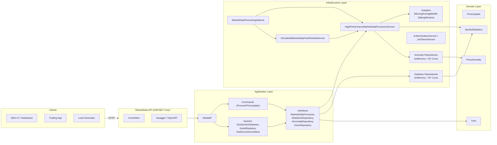
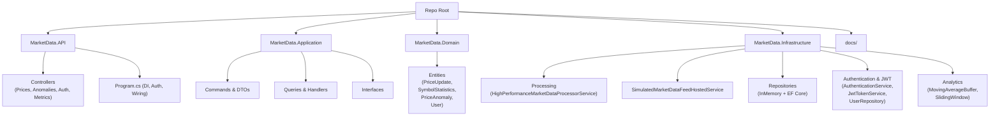
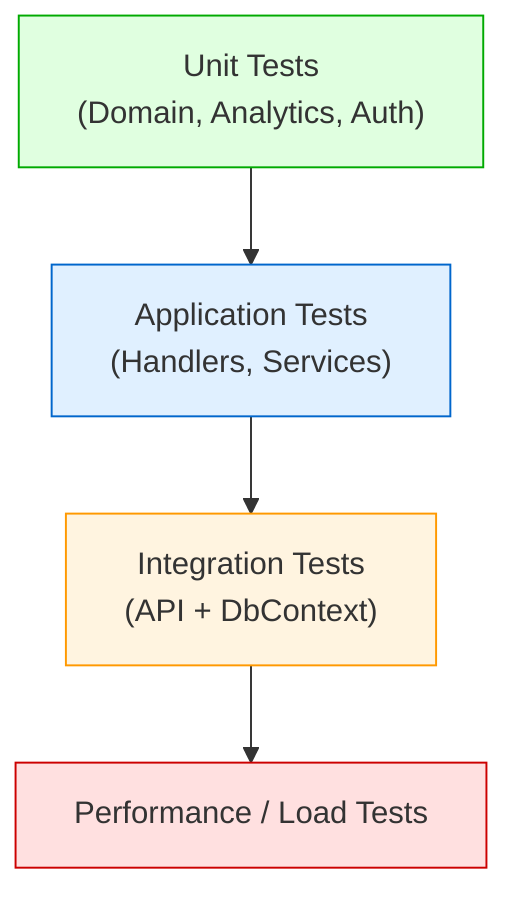
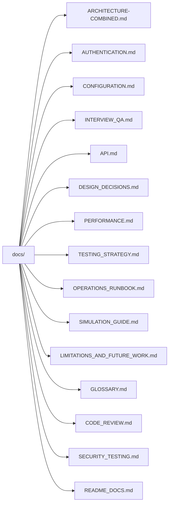

# MarketDataSystem – Real-Time Market Data Processing Platform

> **Goal**: Demonstrate senior-level skills in **system design, high-throughput processing, concurrency, observability, security, and clean architecture** using .NET.

This repository implements a **real-time market data processing engine** that:

- Consumes **high-frequency price updates** (ticks) for multiple symbols,
- Maintains **per-symbol moving averages**,
- Detects **price anomalies (>2% within any 1-second interval)**,
- **Persists aggregated statistics and anomalies to PostgreSQL via EF Core** when persistence is enabled (or uses in-memory repositories for pure demo mode),
- Can optionally use **Redis** for distributed caching,
- **Secures read/write APIs with JWT-based authentication and role-based authorization**,
- Exposes state and metrics via a **clear HTTP API**,
- Includes a built-in **simulation feed** for demos and load testing,
- Is supported by an extensive `docs/` folder for architecture, design, testing, security, and configuration.

---

## 0. Table of Contents

1. [System Overview](#1-system-overview)
2. [Architecture](#2-architecture)
   - [2.1 High-Level View](#21-high-level-view)
   - [2.2 Layered Design](#22-layered-design)
   - [2.3 Component Responsibilities](#23-component-responsibilities)
3. [Data & Control Flows](#3-data--control-flows)
   - [3.1 Write Path (POST /api/prices)](#31-write-path-post-apiprices)
   - [3.2 Read Path (GET /api/prices--apianomalies)](#32-read-path-get-apiprices--apianomalies)
   - [3.3 Internal Processing Flow](#33-internal-processing-flow)
4. [Concurrency & Performance Model](#4-concurrency--performance-model)
5. [Simulation Feed](#5-simulation-feed)
6. [HTTP API Summary](#6-http-api-summary)
7. [Configuration](#7-configuration)
8. [Running the System](#8-running-the-system)
9. [Code Structure & Navigation](#9-code-structure--navigation)
10. [Testing & Quality](#10-testing--quality)
11. [Security & Operations](#11-security--operations)
12. [Using This Project in an Interview](#12-using-this-project-in-an-interview)
13. [Docs Overview](#13-docs-overview)
14. [License](#14-license)

---

## 1. System Overview

The MarketDataSystem is meant to be a **realistic but compact** example of a streaming, real-time system:

- It behaves similarly to a **market data microservice** in finance (but simplified),
- It highlights trade-offs around **latency, throughput, and data structures**,
- It is structured to be **easy to reason about** and **easy to explain**.

**Key capabilities covered:**

- Simulate a **market data feed** with random price updates for multiple symbols.
- Maintain a **moving average of the latest N price updates** per symbol.
- Detect **price spikes greater than 2%** within any **1-second window**.
- Process **10,000+ price updates per second** (throughput target).
- Use **concurrent programming** (channels, tasks, async/await) safely.
- Protect the API surface with **JWT-based auth** and simple role-based policies.
- Persist statistics and anomalies to **PostgreSQL** when required, or run purely in-memory for demos/tests.

---

## 2. Architecture

### 2.1 High-Level View



### 2.2 Layered Design

**Projects:**

- `MarketData.API` – HTTP endpoints, DI configuration, health checks, JWT auth wiring.
- `MarketData.Application` – Commands, queries, DTOs, interfaces.
- `MarketData.Domain` – Core business entities (prices, stats, anomalies, users).
- `MarketData.Infrastructure` – Processor engine, repositories (in-memory + EF Core), simulation, analytics, authentication/JWT.


All dependencies point **inward** (Clean Architecture style).  
Infrastructure depends on Domain and Application; the API depends on Application; Domain is pure.

### 2.3 Component Responsibilities

| Component                                    | Responsibility                                                 |
|----------------------------------------------|----------------------------------------------------------------|
| `HighPerformanceMarketDataProcessorService`  | Real-time ingestion and processing of price updates.           |
| `SimulatedMarketDataFeedHostedService`       | Generate random-walk prices for multiple symbols.              |
| `MovingAverageBuffer`                        | O(1) moving average over last N prices.                        |
| `SlidingWindow` + `MonotonicDeque`          | O(1) amortized min/max over 1-second window.                   |
| `SymbolStatistics`                          | Aggregated state per symbol (current, MA, count, min, max).    |
| `PriceAnomaly`                              | Represents a detected spike (> threshold within window).       |
| `InMemoryStatisticsRepository` / EF version | Read model for current symbol statistics.                      |
| `InMemoryAnomalyRepository` / EF version    | Stores recent anomalies (in memory or PostgreSQL).             |
| `AuthenticationService` + `JwtTokenService` | Login/register, token issuing, refresh, password changes.      |
| `UserRepository`                            | User persistence (PostgreSQL).                                 |
| Commands & Queries (Application)            | Orchestrate use-cases and input/output DTO mapping.            |

---

## 3. Data & Control Flows

### 3.1 Write Path (POST `/api/prices`)

**Goal:** Accept a new price tick and feed it into the processing pipeline.


### 3.2 Read Path (GET `/api/prices` / `/api/anomalies`)

**Goal:** Read current symbol statistics or anomalies.


Anomaly read flow is similar, but goes through `GetRecentAnomaliesQuery` and `IAnomalyRepository`.

### 3.3 Internal Processing Flow

Within each worker:


---

## 4. Concurrency & Performance Model

### 4.1 Partitioned Channel Design


Each partition:

- Has a **bounded channel** with `DropOldest` full mode:
  - Prevents unbounded memory usage.
  - Favors newest data (newest ticks are usually more relevant).
- Has a **single worker** consuming the channel:
  - Single-writer per `SymbolState` ⇒ no heavy locking needed.

### 4.2 Big-O Complexity

| Component              | Operation                       | Complexity | Notes                          |
|------------------------|----------------------------------|-----------:|--------------------------------|
| `MovingAverageBuffer`  | Add new price + compute average |    O(1)    | Ring buffer + running sum      |
| `SlidingWindow`        | Add sample + evict old          | ~ O(1)     | Monotonic deque (amortized)    |
| `SlidingWindow`        | Query min/max                   |    O(1)    | Just peek head of deques       |
| `SymbolStatistics`     | Update                          |    O(1)    | Simple arithmetic              |
| Partition routing      | Symbol → partition              |    O(1)    | Hash modulus                   |

### 4.3 Tick Processing Timeline


(These numbers are illustrative; the important part is **relative order** and **constant cost**.)

---

## 5. Simulation Feed

To make the system **self-contained** and demo-able, we add:

- `SimulatedMarketDataFeedHostedService` – a background service that generates a **random-walk** price series.

### 5.1 Simulation Flow


### 5.2 Simulation Model

For each symbol:

1. Start at `InitialPrice`.
2. On each tick:
   - Compute random jitter in range `[-MaxJitterPercent, +MaxJitterPercent]`.
   - New price = `currentPrice * (1 + jitter)`.
3. Emit `PriceUpdate(symbol, newPrice, timestamp)` to the processor.

Configuration snippet:

```json
"MarketDataProcessing": {
  "Simulation": {
    "Enabled": true,
    "Symbols": [ "AAPL", "GOOG", "MSFT", "EURUSD", "BTCUSD" ],
    "TicksPerSecond": 2000,
    "InitialPrice": 100.0,
    "MaxJitterPercent": 0.01
  }
}
```

---

## 6. HTTP API Summary

For full details and examples, see `docs/API.md`.

### 6.1 Market Data Endpoints

| Method | Path                      | Description                                         |
|--------|---------------------------|-----------------------------------------------------|
| POST   | `/api/prices`             | Enqueue a new price update. **Requires auth.**     |
| GET    | `/api/prices/{symbol}`    | Read stats for one symbol. **Requires auth.**      |
| GET    | `/api/prices`             | Read stats for all symbols. **Requires auth.**     |
| GET    | `/api/anomalies`          | Read recent anomalies (optional symbol filter). **Requires auth.** |
| GET    | `/api/metrics`            | See processing counters and internal metrics. **Requires auth.** |
| GET    | `/health`                 | Simple health probe (liveness).                    |

### 6.2 Authentication Endpoints (JWT)

| Method | Path                     | Description                                  | Auth      |
|--------|--------------------------|----------------------------------------------|-----------|
| POST   | `/api/auth/login`       | Login with username/password, get tokens.    | Anonymous |
| POST   | `/api/auth/register`    | Register new user + login.                   | Anonymous |
| POST   | `/api/auth/refresh`     | Refresh access token using refresh token.    | Anonymous (with valid refresh token) |
| POST   | `/api/auth/logout`      | Logout current user / invalidate session.    | JWT       |
| GET    | `/api/auth/me`          | Get current user profile.                    | JWT       |
| POST   | `/api/auth/change-password` | Change current user's password.           | JWT       |

All protected endpoints require:

```http
Authorization: Bearer <access_token>
```

---

## 7. Configuration

High-level configuration lives in `appsettings*.json`. The most important sections are:

- `ConnectionStrings` – PostgreSQL + Redis,
- `JwtSettings` – secret, issuer/audience, access/refresh expirations,
- `MarketDataProcessing` – partitions, channel capacity, anomaly thresholds, simulation,
- `Serilog` – logging,
- `Cors` – allowed origins.

For a detailed explanation of each section, see `docs/CONFIGURATION.md`.

The core processing options live under `MarketDataProcessing`:

```json
"MarketDataProcessing": {
  "Partitions": 0,
  "ChannelCapacity": 100000,
  "MovingAverageWindow": 64,
  "AnomalyThresholdPercent": 2.0,
  "SlidingWindowMilliseconds": 1000,
  "RecentAnomaliesCapacity": 10000,
  "Simulation": {
    "Enabled": true,
    "Symbols": [ "AAPL", "GOOG", "MSFT", "EURUSD", "BTCUSD" ],
    "TicksPerSecond": 2000,
    "InitialPrice": 100.0,
    "MaxJitterPercent": 0.01
  }
}
```

**Notes:**

- `Partitions = 0` → default to `Environment.ProcessorCount`.
- `ChannelCapacity` is per partition.
- `AnomalyThresholdPercent` is configurable (e.g., 2.0 for 2%).

---

## 8. Running the System

### 8.1 Local (dotnet)

```bash
cd src/MarketData.API
dotnet restore
dotnet run
```

Then:

- Hit `GET /health` to confirm it is up.
- Use `POST /api/auth/register` + `POST /api/auth/login` to obtain a JWT.
- Call the protected endpoints with `Authorization: Bearer <token>`.
- Or rely on the simulation feed (if enabled) for automatic ticks.

### 8.2 Docker (Example)

If a Dockerfile is present (or added):

```bash
docker build -t market-data-api .
docker run -p 8080:8080 market-data-api
```

In a more complete setup, you would typically run:

- API container,
- PostgreSQL,
- Redis,
- Optional Prometheus/Grafana.

---

## 9. Code Structure & Navigation



You can navigate by responsibility:

- Want ingestion logic? → `HighPerformanceMarketDataProcessorService`.
- Want anomaly logic? → `SlidingWindow`, `PriceAnomaly`, `IAnomalyRepository`.
- Want HTTP surface? → `MarketData.API/Controllers`.
- Want auth details? → `AuthController`, `AuthenticationService`, `JwtTokenService`, `User`, `UserRepository`.
- Want design rationale? → `docs/ARCHITECTURE*.md`, `docs/DESIGN_DECISIONS.md`.

---

## 10. Testing & Quality

The solution is structured for a layered testing strategy:



Summary of what is implemented (see `docs/TESTING_STRATEGY.md` for details):

- **~30 unit tests** for domain, analytics, and auth helpers.
- **10 integration tests** using `WebApplicationFactory` and an in-memory test DbContext.
- Ready to extend with k6 / load tests if needed.

---

## 11. Security & Operations

- **Security**:
  - Built-in **JWT Bearer** authentication (access + refresh tokens).
  - **Role- and policy-based authorization** (`Admin`, `User`; `RequireReadAccess`, `RequireWriteAccess`, etc.).
  - Passwords are hashed using **BCrypt** before being stored in PostgreSQL.
  - Input validation via model binding / validators.
  - See `docs/AUTHENTICATION.md` and `docs/SECURITY_TESTING.md` for:
    - Auth design and flows,
    - Threat model,
    - Security test plan and future enhancements.

- **Operations**:
  - `GET /health` for liveness.
  - `GET /api/metrics` for internal counters.
  - Backpressure via bounded channels.
  - Optional Postgres/Redis health checks.
  - See `docs/OPERATIONS_RUNBOOK.md` for:
    - Incident playbooks,
    - Scaling guidance,
    - Config tuning tips.

---

## 12. Using This Project in an Interview

Suggested flow:

1. Start with the **high-level architecture** diagram (section 2.1).
2. Walk through the **write path and read path** sequence diagrams (section 3).
3. Dive into:
   - **Partitioned channels** for concurrency and throughput.
   - **MovingAverageBuffer** and **SlidingWindow** for O(1) analytics.
4. Discuss:
   - **Backpressure strategy** (bounded channels, `DropOldest`).
   - **Anomaly rule** (2% within 1s) and how the sliding window enforces it.
   - **Persistence** model (EF Core/PostgreSQL vs in-memory for demos).
   - **Auth design** (JWT, roles, policies, refresh tokens).
5. Be explicit about:
   - **Limitations** (single-node processor, simple anomaly model, basic roles).
   - **Future work** (message queues, sharding, ML-based anomalies, stronger security).

For deeper technical questions:

- Use `docs/INTERVIEW_QA.md` (long-form Q&A).
- Use `docs/LIMITATIONS_AND_FUTURE_WORK.md` (roadmap and honesty).
- Use `docs/CODE_REVIEW.md` to show you can self-review and critique.

---

## 13. Docs Overview

The `docs/` folder contains **extensive, structured documentation**:



This README is the **entry point**, and the docs folder holds:

- Architecture and design rationale,
- API reference,
- Testing and performance strategy,
- Security and operations runbook,
- Authentication and configuration details,
- Interview-focused Q&A and code review notes.

---

## 14. License

> This project is intended as a **learning and interview demonstration** repository.  
> You are free to read, study, and adapt the approaches described here.
