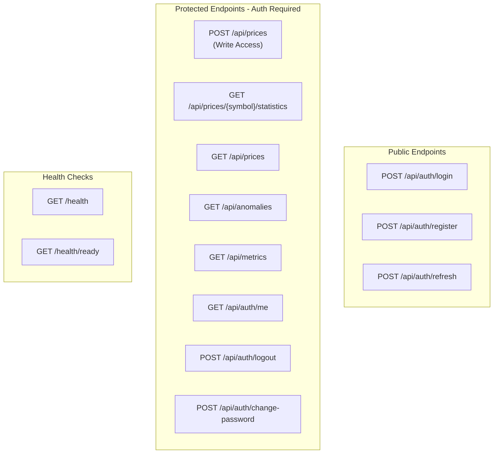

# MarketDataSystem – HTTP API Reference

This document describes the **public HTTP API** exposed by the `MarketData.API` project.

All examples assume a base URL similar to:

- `https://localhost:5001`
- or `http://localhost:5000`

(Your actual port may differ depending on configuration.)

---

##  Table of Contents

- [Overview](#overview)
- [Authentication](#authentication)
- [Authentication Endpoints](#authentication-endpoints)
- [Price Data Endpoints](#price-data-endpoints)
- [Statistics Endpoints](#statistics-endpoints)
- [Anomaly Endpoints](#anomaly-endpoints)
- [Metrics Endpoints](#metrics-endpoints)
- [Health Check Endpoints](#health-check-endpoints)
- [Error Responses](#error-responses)
- [Rate Limiting](#rate-limiting)

---

## 1. Overview

The API follows a **CQRS-style** approach with **JWT authentication**:

### Public Endpoints (No Authentication Required):
- `POST /api/auth/login` – User login
- `POST /api/auth/register` – User registration
- `POST /api/auth/refresh` – Refresh access token

### Protected Endpoints (Authentication Required):
- Write-side:
  - `POST /api/prices` – Process new price updates (Requires Write Access)
- Read-side:
  - `GET /api/prices/{symbol}/statistics` – Read statistics for one symbol
  - `GET /api/prices` – Read statistics for all symbols
  - `GET /api/anomalies` – Read recent anomalies
  - `GET /api/metrics` – Read processing metrics
- User Management:
  - `GET /api/auth/me` – Get current user info
  - `POST /api/auth/logout` – Logout user
  - `POST /api/auth/change-password` – Change password
- Health:
  - `GET /health` – Health check
  - `GET /health/ready` – Readiness check

### API Shape Diagram



---

## 2. Authentication

All protected endpoints require a **JWT Bearer token** in the `Authorization` header:

```
Authorization: Bearer <your-jwt-token>
```

### Obtaining a Token

1. **Register** a new user: `POST /api/auth/register`
2. **Login** with credentials: `POST /api/auth/login`
3. Use the `accessToken` from the response in subsequent requests

### Token Expiration

- **Access Token**: Expires after 60 minutes (configurable)
- **Refresh Token**: Expires after 7 days (configurable)
- Use `POST /api/auth/refresh` to obtain a new access token

---

## 3. Authentication Endpoints

### 3.1 POST /api/auth/register

Register a new user account.

**Request:**
```bash
curl -X POST https://localhost:5001/api/auth/register \
  -H "Content-Type: application/json" \
  -d '{
    "username": "testuser",
    "email": "test@example.com",
    "password": "SecurePass123!",
    "firstName": "Test",
    "lastName": "User"
  }'
```

**Request Body:**
```json
{
  "username": "testuser",
  "email": "test@example.com",
  "password": "SecurePass123!",
  "firstName": "Test",
  "lastName": "User"
}
```

**Validation Rules:**
- `username`: Required, 3-50 characters
- `email`: Required, valid email format
- `password`: Required, minimum 6 characters
- `firstName`, `lastName`: Optional

**Response (201 Created):**
```json
{
  "accessToken": "eyJhbGciOiJIUzI1NiIsInR5cCI6IkpXVCJ9...",
  "refreshToken": "Zdkl3jK9mNpQrStUvWxYz...",
  "expiresAt": "2025-11-06T11:00:00Z",
  "user": {
    "id": "550e8400-e29b-41d4-a716-446655440000",
    "username": "testuser",
    "email": "test@example.com",
    "firstName": "Test",
    "lastName": "User",
    "role": "User"
  }
}
```

**Error Responses:**
- `400 Bad Request`: Validation failed
- `409 Conflict`: Username or email already exists

---

### 3.2 POST /api/auth/login

Authenticate user and obtain tokens.

**Request:**
```bash
curl -X POST https://localhost:5001/api/auth/login \
  -H "Content-Type: application/json" \
  -d '{
    "username": "testuser",
    "password": "SecurePass123!"
  }'
```

**Request Body:**
```json
{
  "username": "testuser",
  "password": "SecurePass123!"
}
```

**Response (200 OK):**
```json
{
  "accessToken": "eyJhbGciOiJIUzI1NiIsInR5cCI6IkpXVCJ9...",
  "refreshToken": "Zdkl3jK9mNpQrStUvWxYz...",
  "expiresAt": "2025-11-06T11:00:00Z",
  "user": {
    "id": "550e8400-e29b-41d4-a716-446655440000",
    "username": "testuser",
    "email": "test@example.com",
    "firstName": "Test",
    "lastName": "User",
    "role": "User"
  }
}
```

**Error Responses:**
- `400 Bad Request`: Missing credentials
- `401 Unauthorized`: Invalid username or password

**Default Test Users:**

| Username | Password | Role |
|----------|----------|------|
| admin | Admin@123 | Admin |
| demo | Demo@123 | User |

---

### 3.3 POST /api/auth/refresh

Refresh an expired access token using a refresh token.

**Request:**
```bash
curl -X POST https://localhost:5001/api/auth/refresh \
  -H "Content-Type: application/json" \
  -d '{
    "refreshToken": "Zdkl3jK9mNpQrStUvWxYz..."
  }'
```

**Request Body:**
```json
{
  "refreshToken": "Zdkl3jK9mNpQrStUvWxYz..."
}
```

**Response (200 OK):**
```json
{
  "accessToken": "eyJhbGciOiJIUzI1NiIsInR5cCI6IkpXVCJ9...",
  "refreshToken": "NewRefreshToken123...",
  "expiresAt": "2025-11-06T12:00:00Z",
  "user": {
    "id": "550e8400-e29b-41d4-a716-446655440000",
    "username": "testuser",
    "email": "test@example.com",
    "role": "User"
  }
}
```

**Error Responses:**
- `401 Unauthorized`: Invalid or expired refresh token

---

### 3.4 GET /api/auth/me

Get current authenticated user information.

**Authentication:** Required (Bearer Token)

**Request:**
```bash
curl -X GET https://localhost:5001/api/auth/me \
  -H "Authorization: Bearer <your-token>"
```

**Response (200 OK):**
```json
{
  "id": "550e8400-e29b-41d4-a716-446655440000",
  "username": "testuser",
  "email": "test@example.com",
  "firstName": "Test",
  "lastName": "User",
  "role": "User"
}
```

**Error Responses:**
- `401 Unauthorized`: Missing or invalid token

---

### 3.5 POST /api/auth/logout

Logout current user and invalidate refresh token.

**Authentication:** Required (Bearer Token)

**Request:**
```bash
curl -X POST https://localhost:5001/api/auth/logout \
  -H "Authorization: Bearer <your-token>"
```

**Response (204 No Content)**

**Error Responses:**
- `401 Unauthorized`: Missing or invalid token

---

### 3.6 POST /api/auth/change-password

Change current user's password.

**Authentication:** Required (Bearer Token)

**Request:**
```bash
curl -X POST https://localhost:5001/api/auth/change-password \
  -H "Authorization: Bearer <your-token>" \
  -H "Content-Type: application/json" \
  -d '{
    "currentPassword": "OldPass123!",
    "newPassword": "NewSecurePass456!"
  }'
```

**Request Body:**
```json
{
  "currentPassword": "OldPass123!",
  "newPassword": "NewSecurePass456!"
}
```

**Response (204 No Content)**

**Error Responses:**
- `400 Bad Request`: Invalid current password or validation failed
- `401 Unauthorized`: Missing or invalid token

---

## 4. Price Data Endpoints

### 4.1 POST /api/prices

Process a new **price update** for a symbol.

**Authentication:** Required (Write Access)

**Request:**
```bash
curl -X POST https://localhost:5001/api/prices \
  -H "Authorization: Bearer <your-token>" \
  -H "Content-Type: application/json" \
  -d '{
    "symbol": "AAPL",
    "price": 150.50,
    "timestamp": "2025-11-06T10:00:00Z"
  }'
```

**Request Body:**
```json
{
  "symbol": "AAPL",
  "price": 150.50,
  "timestamp": "2025-11-06T10:00:00Z"
}
```

**Validation Rules:**
- `symbol`: Required, uppercase letters only, max 10 characters
- `price`: Required, > 0, < 1,000,000
- `timestamp`: Required, cannot be in the future

**Response (200 OK):**
```json
{
  "success": true,
  "symbol": "AAPL",
  "price": 150.50,
  "timestamp": "2025-11-06T10:00:00Z",
  "processedAt": "2025-11-06T10:00:01Z"
}
```

**Error Responses:**
- `400 Bad Request`: Validation failed
- `401 Unauthorized`: Missing or invalid token
- `403 Forbidden`: Insufficient permissions

---

## 5. Statistics Endpoints

### 5.1 GET /api/prices/{symbol}/statistics

Get aggregated statistics for a specific symbol.

**Authentication:** Required (Read Access)

**Request:**
```bash
curl -X GET https://localhost:5001/api/prices/AAPL/statistics \
  -H "Authorization: Bearer <your-token>"
```

**Response (200 OK):**
```json
{
  "symbol": "AAPL",
  "currentPrice": 150.50,
  "movingAverage": 149.75,
  "minPrice": 145.00,
  "maxPrice": 155.00,
  "updateCount": 1000,
  "lastUpdateTime": "2025-11-06T10:00:00Z",
  "changeFromAverage": 0.50
}
```

**Error Responses:**
- `401 Unauthorized`: Missing or invalid token
- `404 Not Found`: No statistics found for symbol

---

### 5.2 GET /api/prices

Get aggregated statistics for all symbols.

**Authentication:** Required (Read Access)

**Request:**
```bash
curl -X GET https://localhost:5001/api/prices \
  -H "Authorization: Bearer <your-token>"
```

**Response (200 OK):**
```json
[
  {
    "symbol": "AAPL",
    "currentPrice": 150.50,
    "movingAverage": 149.75,
    "minPrice": 145.00,
    "maxPrice": 155.00,
    "updateCount": 1000,
    "lastUpdateTime": "2025-11-06T10:00:00Z",
    "changeFromAverage": 0.50
  },
  {
    "symbol": "GOOG",
    "currentPrice": 2800.00,
    "movingAverage": 2795.50,
    "minPrice": 2750.00,
    "maxPrice": 2850.00,
    "updateCount": 850,
    "lastUpdateTime": "2025-11-06T10:00:00Z",
    "changeFromAverage": 0.16
  }
]
```

---

## 6. Anomaly Endpoints

### 6.1 GET /api/anomalies

Get recent price anomalies.

**Authentication:** Required (Read Access)

**Query Parameters:**
- `symbol` (optional): Filter by symbol
- `take` (optional): Number of anomalies to return (default: 100)

**Request:**
```bash
curl -X GET "https://localhost:5001/api/anomalies?symbol=AAPL&take=10" \
  -H "Authorization: Bearer <your-token>"
```

**Response (200 OK):**
```json
[
  {
    "id": "123e4567-e89b-12d3-a456-426614174000",
    "symbol": "AAPL",
    "oldPrice": 150.00,
    "newPrice": 160.00,
    "changePercent": 6.67,
    "severity": "Critical",
    "detectedAt": "2025-11-06T10:00:00Z"
  }
]
```

**Severity Levels:**
- `Medium`: 0-3% change
- `High`: 3-5% change
- `Critical`: >5% change

---

## 7. Metrics Endpoints

### 7.1 GET /api/metrics

Get real-time processing metrics.

**Authentication:** Required (Read Access)

**Request:**
```bash
curl -X GET https://localhost:5001/api/metrics \
  -H "Authorization: Bearer <your-token>"
```

**Response (200 OK):**
```json
{
  "totalProcessed": 50000,
  "anomaliesDetected": 25,
  "activeSymbols": 5,
  "queueSize": 100,
  "throughputPerSecond": 2000
}
```

---

## 8. Health Check Endpoints

### 8.1 GET /health

Overall health status of the application.

**Authentication:** Not Required

**Request:**
```bash
curl -X GET https://localhost:5001/health
```

**Response (200 OK):**
```json
{
  "status": "Healthy",
  "totalDuration": "00:00:00.0123456",
  "entries": {
    "market_data_processor": {
      "status": "Healthy",
      "description": "Market data processor is running",
      "data": {
        "total_processed": 50000,
        "anomalies_detected": 25,
        "active_symbols": 5,
        "queue_size": 100,
        "throughput": 2000
      }
    },
    "postgres": {
      "status": "Healthy"
    },
    "redis": {
      "status": "Healthy"
    }
  }
}
```

**Possible Status Values:**
- `Healthy`: All systems operational
- `Degraded`: Some non-critical issues
- `Unhealthy`: Critical issues detected

---

### 8.2 GET /health/ready

Readiness probe for orchestrators (Kubernetes).

**Request:**
```bash
curl -X GET https://localhost:5001/health/ready
```

**Response (200 OK):**
```json
{
  "status": "Healthy"
}
```

---

## 9. Error Responses

### Standard Error Format

```json
{
  "message": "Error description",
  "errors": {
    "fieldName": ["Error message 1", "Error message 2"]
  }
}
```

### HTTP Status Codes

| Code | Description |
|------|-------------|
| 200 | Success |
| 201 | Created (registration) |
| 204 | No Content (logout, password change) |
| 400 | Bad Request (validation errors) |
| 401 | Unauthorized (authentication required) |
| 403 | Forbidden (insufficient permissions) |
| 404 | Not Found (resource doesn't exist) |
| 409 | Conflict (duplicate resource) |
| 429 | Too Many Requests (rate limit exceeded) |
| 500 | Internal Server Error |

---

## 10. Rate Limiting

The API implements rate limiting to prevent abuse:

### Default Limits:
- **Per Second**: 10 requests
- **Per Minute**: 200 requests
- **Per Hour**: 1,000 requests

### Rate Limit Headers:

```
X-Rate-Limit-Limit: 10
X-Rate-Limit-Remaining: 5
X-Rate-Limit-Reset: 2025-11-06T10:00:01Z
```

### Rate Limit Exceeded Response (429):

```json
{
  "message": "Rate limit exceeded. Please try again later."
}
```

### Localhost Bypass:

Requests from `127.0.0.1` have higher limits (1000/second) for development.

---

## 11. Swagger UI

Interactive API documentation is available at:

**Development:** `https://localhost:5001/`

The Swagger UI provides:
- Interactive API testing
- Request/response examples
- Schema definitions
- Authentication support (click "Authorize" button)

---

## 12. Examples with cURL

### Complete Authentication Flow:

```bash
# 1. Register a new user
TOKEN_RESPONSE=$(curl -s -X POST https://localhost:5001/api/auth/register \
  -H "Content-Type: application/json" \
  -d '{"username":"testuser","email":"test@example.com","password":"Test@123"}')

# 2. Extract access token
ACCESS_TOKEN=$(echo $TOKEN_RESPONSE | jq -r '.accessToken')

# 3. Use token to access protected endpoint
curl -X GET https://localhost:5001/api/prices \
  -H "Authorization: Bearer $ACCESS_TOKEN"

# 4. Submit a price update
curl -X POST https://localhost:5001/api/prices \
  -H "Authorization: Bearer $ACCESS_TOKEN" \
  -H "Content-Type: application/json" \
  -d '{"symbol":"AAPL","price":150.50,"timestamp":"2025-11-06T10:00:00Z"}'
```

---

## 13. Client Libraries

### JavaScript/TypeScript

```typescript
// Login and get token
const response = await fetch('https://localhost:5001/api/auth/login', {
  method: 'POST',
  headers: { 'Content-Type': 'application/json' },
  body: JSON.stringify({
    username: 'testuser',
    password: 'Test@123'
  })
});

const { accessToken } = await response.json();

// Use token for subsequent requests
const pricesResponse = await fetch('https://localhost:5001/api/prices', {
  headers: { 'Authorization': `Bearer ${accessToken}` }
});

const prices = await pricesResponse.json();
```

### Python

```python
import requests

# Login
response = requests.post(
    'https://localhost:5001/api/auth/login',
    json={'username': 'testuser', 'password': 'Test@123'}
)
token = response.json()['accessToken']

# Use token
headers = {'Authorization': f'Bearer {token}'}
prices = requests.get('https://localhost:5001/api/prices', headers=headers)
print(prices.json())
```

---

## 14. Support

For questions or issues:
- GitHub Issues: https://github.com/yasserebrahimi/MarketDataSystem/issues
- Email: yasser.ebrahimi@outlook.com

---

**Last Updated:** 2025-11-06
**API Version:** 1.0.0
