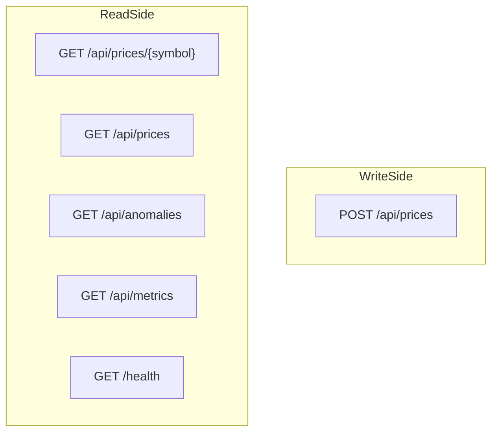
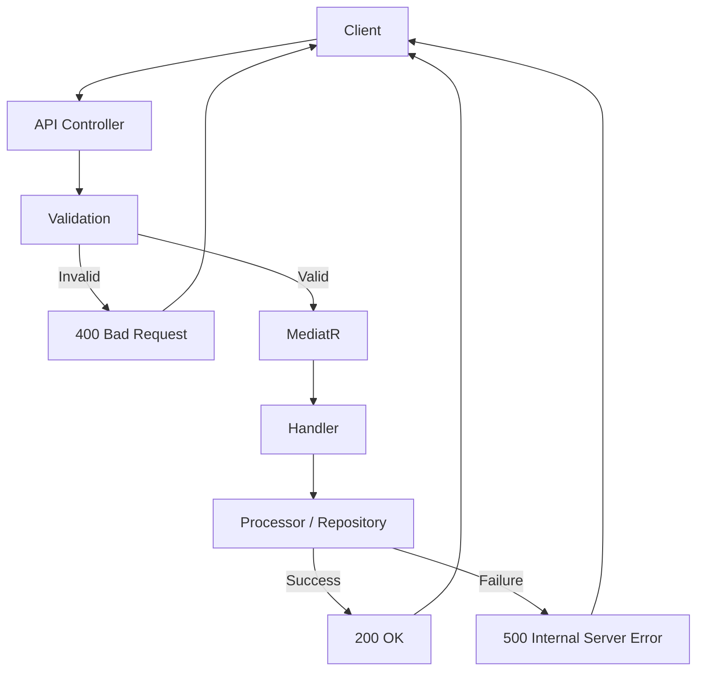

# MarketDataSystem – HTTP API Reference

This document describes the **public HTTP API** exposed by the `MarketData.API` project.

All examples assume a base URL similar to:

- `https://localhost:5001`
- or `http://localhost:5000`

(Your actual port may differ depending on configuration.)

---

## 1. Overview

The API follows a **CQRS-style** approach:

- Write-side:
  - `POST /api/prices` – enqueue new price updates.
- Read-side:
  - `GET /api/prices/{symbol}` – read statistics for one symbol.
  - `GET /api/prices` – read statistics for all symbols.
  - `GET /api/anomalies` – read recent anomalies.
  - `GET /api/metrics` – read processing metrics.
  - `GET /health` – health check for orchestrators/monitoring.

### 1.1 API Shape Diagram



---

## 2. POST /api/prices

Enqueues a new **price update** for a symbol into the real-time processing pipeline.

- **Method**: `POST`
- **URL**: `/api/prices`
- **Body (JSON)**:

```json
{
  "symbol": "EURUSD",
  "price": 1.0853,
  "timestamp": "2025-11-06T10:00:00Z"
}
```

- `symbol` (string, required):
  - Non-empty, max length ~32 chars (enforced by validation).
- `price` (number, required):
  - Must be > 0.
- `timestamp` (ISO-8601, optional):
  - If omitted, server may use current UTC time.

### 2.1 Example Request

```bash
curl -X POST https://localhost:5001/api/prices   -H "Content-Type: application/json"   -d '{
    "symbol": "EURUSD",
    "price": 1.0853,
    "timestamp": "2025-11-06T10:00:00Z"
  }'
```

### 2.2 Example Response

```json
{
  "success": true,
  "message": "Price update enqueued successfully."
}
```

Typical status codes:

| Code | Meaning                              |
|------|--------------------------------------|
| 200  | Update accepted and enqueued         |
| 400  | Validation failed                    |
| 500  | Internal server error                |

---

## 3. GET /api/prices/{symbol}

Returns **aggregated statistics** for a single symbol.

- **Method**: `GET`
- **URL**: `/api/prices/{symbol}`

Example:

```bash
curl https://localhost:5001/api/prices/EURUSD
```

### 3.1 Example Response

```json
{
  "symbol": "EURUSD",
  "currentPrice": 1.0853,
  "movingAverage": 1.0849,
  "updateCount": 1203,
  "lastUpdateTime": "2025-11-06T10:00:02.1234567Z",
  "minPrice": 1.0800,
  "maxPrice": 1.0900
}
```

Fields:

| Field            | Type    | Description                                          |
|------------------|---------|------------------------------------------------------|
| `symbol`         | string  | Symbol key (e.g., `EURUSD`, `AAPL`).                |
| `currentPrice`   | number  | Latest observed price.                               |
| `movingAverage`  | number  | Moving average over last N ticks.                    |
| `updateCount`    | number  | How many ticks have been processed for this symbol.  |
| `lastUpdateTime` | string  | Timestamp of the last update.                        |
| `minPrice`       | number  | Minimum observed price (across lifetime).            |
| `maxPrice`       | number  | Maximum observed price (across lifetime).            |

---

## 4. GET /api/prices

Returns **statistics for all symbols** currently tracked.

- **Method**: `GET`
- **URL**: `/api/prices`

Example:

```bash
curl https://localhost:5001/api/prices
```

Example response (truncated):

```json
[
  {
    "symbol": "EURUSD",
    "currentPrice": 1.0853,
    "movingAverage": 1.0849,
    "updateCount": 1203,
    "lastUpdateTime": "2025-11-06T10:00:02.1234567Z",
    "minPrice": 1.0800,
    "maxPrice": 1.0900
  },
  {
    "symbol": "AAPL",
    "currentPrice": 190.12,
    "movingAverage": 189.90,
    "updateCount": 998,
    "lastUpdateTime": "2025-11-06T10:00:02.1000000Z",
    "minPrice": 188.10,
    "maxPrice": 191.50
  }
]
```

---

## 5. GET /api/anomalies

Returns **recent anomalies** (price spikes) detected by the system.

- **Method**: `GET`
- **URL**: `/api/anomalies`
- **Query parameters**:

| Name   | Type   | Required | Default | Description                             |
|--------|--------|----------|---------|-----------------------------------------|
| symbol | string | no       | null    | If provided, filter to that symbol only |
| take   | int    | no       | 100     | Max number of anomalies                 |

Example:

```bash
curl "https://localhost:5001/api/anomalies?symbol=EURUSD&take=20"
```

---

## 6. GET /api/metrics

Returns **processing metrics** from the high-performance processor.

- **Method**: `GET`
- **URL**: `/api/metrics`

Example:

```bash
curl https://localhost:5001/api/metrics
```

Example shape (implementation-specific):

```json
{
  "totalProcessedTicks": 2000000,
  "anomaliesDetected": 123,
  "activeSymbols": 42,
  "queueSize": 1500,
  "throughputPerSecond": 9850.5
}
```

---

## 7. GET /health

Liveness/health probe.

- **Method**: `GET`
- **URL**: `/health`
- **Response**: HTTP 200 when the service is running.

Used by Kubernetes, load balancers, and monitoring systems.

---

## 8. Error Handling Flow


