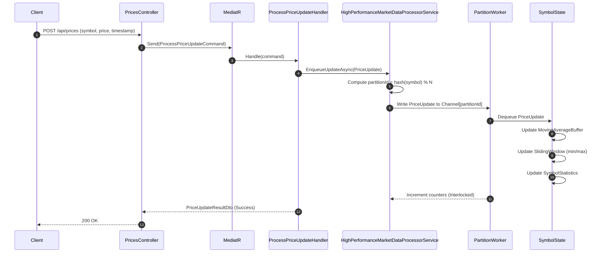
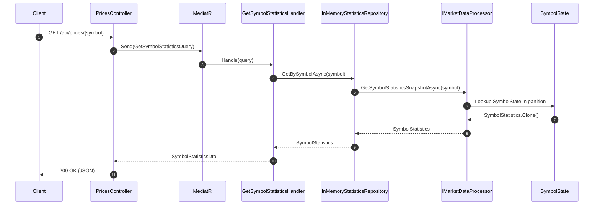
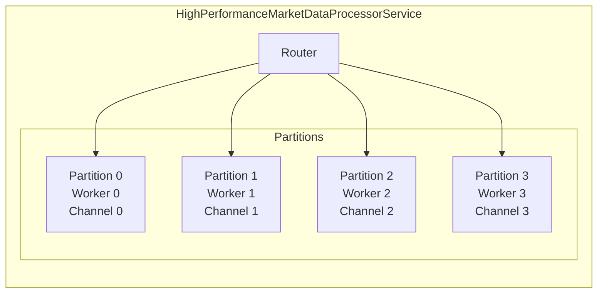
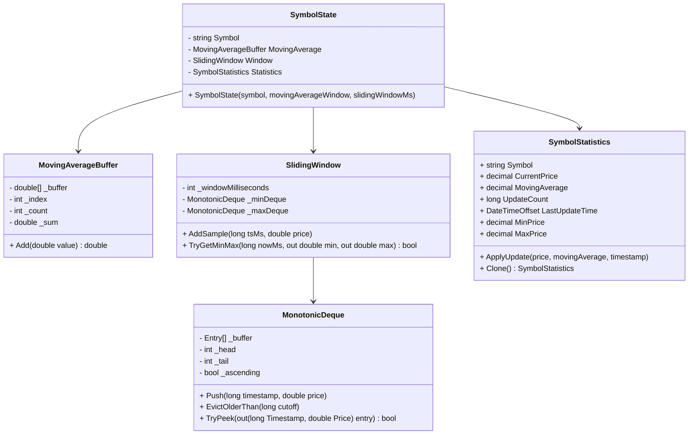
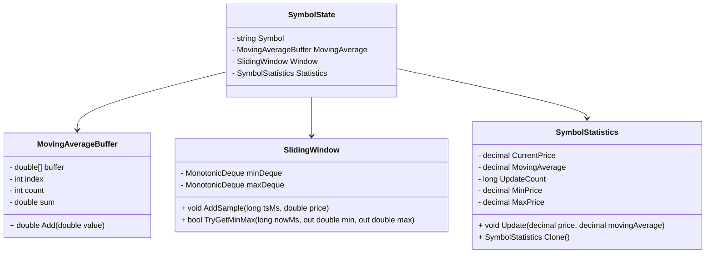

# MarketDataSystem – Combined Architecture (Deep Dive, Fully English)

This document explains the architecture of the **MarketDataSystem** from multiple angles,
combining:

- **Clean Architecture / CQRS** (API, Application, Domain, Infrastructure)
- **High-performance streaming pipeline** using `Channel<T>`, partitioned workers, and O(1) data structures

It is intentionally detailed to serve both as documentation and a study guide.

---

## 1. System Overview

At a high level, the system:

1. Exposes an **HTTP API** that accepts price updates and serves per-symbol statistics.
2. Internally runs a **high-throughput processing pipeline** that:
   - Ingests `PriceUpdate` events
   - Groups them by symbol into partitions
   - Maintains a moving average of the last _N_ prices per symbol
   - Maintains a sliding 1-second window for each symbol
   - Detects spikes ≥ ±2% within that sliding window
   - Keeps aggregated `SymbolStatistics` in memory for fast reads

### 1.1 High-Level Data Flow

```mermaid
flowchart LR
    subgraph ClientLayer[Clients]
        C1[Trading App]
        C2[Monitoring Tool]
    end

    subgraph ApiLayer[MarketData.API]
        API[ASP.NET Core
PricesController]
    end

    subgraph AppLayer[Application]
        CMD[Commands
(ProcessPriceUpdate)]
        QRY[Queries
(GetSymbolStatistics)]
        INTF[Interfaces
IMarketDataProcessor
IStatisticsRepository]
    end

    subgraph InfraLayer[Infrastructure]
        PROC[HighPerformanceMarketDataProcessorService]
        REPO[InMemoryStatisticsRepository]
        MA[MovingAverageBuffer]
        WIN[SlidingWindow]
    end

    subgraph DomainLayer[Domain]
        PU[PriceUpdate]
        SS[SymbolStatistics]
        PA[PriceAnomaly]
    end

    C1 -->|POST /api/prices| API
    C2 -->|GET /api/prices/{symbol}| API

    API --> CMD --> INTF --> PROC
    API --> QRY --> INTF --> REPO --> PROC

    PROC --> MA
    PROC --> WIN
    PROC --> SS
    PROC --> PA
```

This diagram shows how read and write paths share a common core (`IMarketDataProcessor`)
but remain decoupled at the API/Application level.

---

## 2. Layered Architecture

We follow a simplified **Clean Architecture** style. Each project represents a layer.

```mermaid
graph TD
    subgraph API[MarketData.API
(Presentation)]
        A1[PricesController]
    end

    subgraph APP[MarketData.Application
(Application)]
        B1[Commands]
        B2[Queries]
        B3[DTOs]
        B4[Interfaces]
    end

    subgraph DOMAIN[MarketData.Domain
(Domain)]
        C1[PriceUpdate]
        C2[SymbolStatistics]
        C3[PriceAnomaly]
    end

    subgraph INFRA[MarketData.Infrastructure
(Infrastructure)]
        D1[HighPerformanceMarketDataProcessorService]
        D2[InMemoryStatisticsRepository]
        D3[MovingAverageBuffer]
        D4[SlidingWindow]
        D5[MarketDataProcessingOptions]
    end

    A1 --> B1
    A1 --> B2
    B1 --> B4
    B2 --> B4
    B4 --> INFRA
    INFRA --> DOMAIN
```

### 2.1 Project Responsibilities

| Project                    | Responsibility                                                                 |
|----------------------------|-------------------------------------------------------------------------------|
| `MarketData.API`           | HTTP interface, controllers, Swagger, DI wiring                               |
| `MarketData.Application`   | Commands, queries, validation, DTOs, interfaces (IMarketDataProcessor, etc.) |
| `MarketData.Domain`        | Core domain entities and logic (PriceUpdate, SymbolStatistics, PriceAnomaly) |
| `MarketData.Infrastructure`| Concrete implementation of processor, repository, analytics data structures   |

---

## 3. Write Path (Price Updates)

### 3.1 Sequence of a Write Request



### 3.2 Internal Timeline (Single Tick)

```mermaid
gantt
    dateFormat  X
    axisFormat  %L

    section API Layer
    HTTP Request Handling      :done, 0, 3
    Model Binding & Validation :done, 3, 7

    section Application Layer
    MediatR Dispatch           :done, 7, 9
    Command Handler Mapping    :done, 9, 12

    section Infrastructure Layer
    Enqueue to Channel         :done, 12, 15
    Worker Dequeues            :done, 15, 20
    MovingAverageBuffer Update :done, 20, 22
    SlidingWindow Update       :done, 22, 25
    Anomaly Detection          :done, 25, 29
    SymbolStatistics Update    :done, 29, 33
```



The absolute numbers are illustrative; the important point is the ordering and that each step is O(1).

### 3.3 Detailed Write Path Steps

1. **HTTP POST** hits `PricesController.PostAsync`.
2. ASP.NET Core:
   - Binds the JSON body to `ProcessPriceUpdateCommand`.
   - Runs FluentValidation (`ProcessPriceUpdateCommandValidator`).
3. Controller sends the command via **MediatR** to its handler.
4. The handler:
   - Constructs a domain `PriceUpdate` (symbol, price, timestamp).
   - Calls `IMarketDataProcessor.EnqueueUpdateAsync(update)`.
5. `HighPerformanceMarketDataProcessorService`:
   - Computes a partition ID based on `symbol.GetHashCode()`.
   - Writes the update to `Channel<PriceUpdate>` for that partition.
6. The corresponding worker reads from the channel and updates its `SymbolState`.
7. `SymbolStatistics` is updated so read-side queries can use it immediately.

---

## 4. Read Path (Statistics)

### 4.1 Sequence of a Read Request



The key points:

- The query path is **read-only** and does not mutate state.
- A **clone** of `SymbolStatistics` is returned to avoid external mutation.

---

## 5. High-Performance Core Design

The high-performance core lives in `MarketData.Infrastructure` and is implemented by
`HighPerformanceMarketDataProcessorService` along with helper types.

### 5.1 Partitioning and Channels

The processor uses **partitioned channels** to scale out processing both logically and physically.



- **Router**: decides which partition receives a `PriceUpdate`.
- Partition count is configured via `MarketDataProcessingOptions.Partitions` (0 = auto, use CPU count).
- Each partition has:
  - A **bounded `Channel<PriceUpdate>`**
  - A **single worker task** reading from that channel
  - A **partition-local state** (`PartitionState`) containing `SymbolState` instances

### 5.2 SymbolState and Data Structures



#### 5.2.1 MovingAverageBuffer

- A **fixed-size ring buffer** over `double` values.
- Fields:
  - `_buffer`: array of values
  - `_index`: index of the next position to overwrite
  - `_count`: number of valid elements (≤ capacity)
  - `_sum`: running sum
- When adding a new value:
  - If `_count < capacity`: just append, update `_sum` and `_count`.
  - Else: subtract oldest value (at `_index`) from `_sum`, overwrite that slot, add new value to `_sum`.
- Returns `_sum / _count` each time.
- Complexity: **O(1)** per update, **no allocations** after construction.

#### 5.2.2 SlidingWindow

- Maintains a sliding window of prices for a given time span (default 1000 ms).
- Uses two **monotonic deques**:
  - `_minDeque`: non-decreasing prices → head is the current **minimum** in the window.
  - `_maxDeque`: non-increasing prices → head is the current **maximum**.

Operations:

1. `AddSample(timestampMs, price)`:
   - Evict elements older than `timestampMs - windowMs` from both deques.
   - From the tail:
     - For `_minDeque`, remove elements with price > new price.
     - For `_maxDeque`, remove elements with price < new price.
   - Append the new sample at the tail.
2. `TryGetMinMax(nowMs, out min, out max)`:
   - Evict elements older than `nowMs - windowMs`.
   - Peek the head of each deque for min and max.

This ensures:

- O(1) amortized time per sample.
- No scanning through the entire history.

### 5.3 Anomaly Detection

For each tick in the worker:

1. Update `SlidingWindow` with `(timestampMs, price)`.
2. Call `TryGetMinMax(timestampMs, out min, out max)`:
   - If false (window empty), skip anomaly detection.
3. Let `threshold = AnomalyThresholdPercent / 100m` (e.g., 2% → 0.02).
4. **Upward spike** check:
   - If `min > 0`:
     - `changeUp = (price - min) / min` (decimal)
     - If `changeUp > threshold`, create a `PriceAnomaly` with direction `Up` and log via `IAnomalySink`.
5. **Downward spike** check:
   - If `max > 0`:
     - `changeDown = (price - max) / max`
     - If `changeDown < -threshold`, create a `PriceAnomaly` with direction `Down` and log via `IAnomalySink`.

This logic is symmetric and configurable via `MarketDataProcessingOptions.AnomalyThresholdPercent`.

### 5.4 Thread-Safety and PartitionState

`HighPerformanceMarketDataProcessorService` contains:

- `_partitions`: array of channels (`Channel<PriceUpdate>[]`)
- `_partitionStates`: array of `PartitionState` objects
- `_workers`: array of worker tasks, one per partition
- `_cts`: a `CancellationTokenSource` for lifecycle management

`PartitionState` contains:

- `ConcurrentDictionary<string, SymbolState>` for symbol → state mappings.
- `IAnomalySink` for anomaly handling.

Although only a single worker writes to each `PartitionState.Symbols` dictionary, we use
`ConcurrentDictionary` for defensive programming (it can tolerate future changes where other
readers might access it concurrently without adding extra locks).

Global counters (`_totalProcessed`, `_anomaliesDetected`) are updated using `Interlocked`.

---

## 6. Configuration and Backpressure

### 6.1 MarketDataProcessingOptions

Defined in `MarketData.Infrastructure.Options` and bound from `appsettings.json`:

| Option                      | Type    | Default | Description                                                   |
|-----------------------------|---------|---------|---------------------------------------------------------------|
| `Partitions`                | int     | 0       | Number of partitions/workers. 0 = use `Environment.ProcessorCount`. |
| `ChannelCapacity`           | int     | 100000  | Bounded capacity per partition channel.                       |
| `MovingAverageWindow`       | int     | 64      | Number of samples used for the moving average.                |
| `AnomalyThresholdPercent`   | decimal | 2.0     | Threshold used for anomaly detection (e.g., 2% spikes).       |
| `SlidingWindowMilliseconds` | int     | 1000    | Sliding window length for min/max and spike detection.        |

### 6.2 Backpressure Strategy

- Each partition channel is **bounded** with capacity `ChannelCapacity`.
- `FullMode = BoundedChannelFullMode.DropOldest`:
  - When the channel is full and a new item arrives:
    - The **oldest** item in that partition is dropped.
- Rationale:
  - Protects the system from unbounded memory growth.
  - Keeps the pipeline responsive under load.
  - For market data, dropping some older tick samples in extreme overload is often acceptable.

This policy can be easily changed if the business requires a different behavior (e.g., `DropNewest`, or blocking producers).

---

## 7. Error Handling and Observability

### 7.1 Error Handling in Workers

The `WorkerLoopAsync` method wraps its processing in a `try/catch`:

- `OperationCanceledException` is treated as normal shutdown.
- Other exceptions are logged via `ILogger<HighPerformanceMarketDataProcessorService>`.

This prevents one worker crash from silently killing the partition pipeline.

### 7.2 Logging

- ASP.NET Core logging is configured via `Logging` config.
- `HighPerformanceMarketDataProcessorService` logs start/stop and worker errors.
- `LoggingAnomalySink` writes anomalies to the console; this is intentionally simple but can be replaced with a structured sink (e.g., Serilog, OpenTelemetry).

### 7.3 Metrics

The processor exposes:

- `TotalProcessedTicks`  
- `AnomaliesDetected`  

via the `ProcessingStatistics` DTO. These can be exposed through an endpoint or health check if desired,
or integrated into monitoring dashboards.

---

## 8. Testing and Debuggability

### 8.1 Unit Testing Strategy (Conceptual)

Even though this repository is focused on demonstrating the architecture and core logic, it has been
structured to be testable:

- **Domain** (pure classes, no infrastructure)
  - `PriceUpdate`, `SymbolStatistics`, `PriceAnomaly` are straightforward to test.
- **Analytics** (infrastructure, but pure computation)
  - `MovingAverageBuffer`: can be tested with known sequences and expected averages.
  - `SlidingWindow`: can be tested with synthetic timestamps to verify min/max behavior.
- **Application**
  - Command and query handlers can be tested by mocking `IMarketDataProcessor` and `IStatisticsRepository`.
- **Infrastructure / Processor**
  - Can be tested in isolation with a test harness that feeds updates and then queries statistics;

For brevity, this repository does not include a full test suite, but the structure is explicitly test-friendly.

### 8.2 Debugging Live in an Interview

1. Open `MarketDataSystem.sln`.
2. Set `MarketData.API` as the startup project.
3. Place breakpoints at:
   - `ProcessPriceUpdateCommandHandler.Handle`
   - `HighPerformanceMarketDataProcessorService.EnqueueUpdateAsync`
   - `WorkerLoopAsync` inside `HighPerformanceMarketDataProcessorService`
   - `GetSymbolStatisticsQueryHandler.Handle`
4. Send POST requests to `/api/prices` (via Swagger or curl).
5. Step through the pipeline and inspect:
   - The mapping from command → `PriceUpdate`
   - Partition routing
   - `SymbolState` internals (moving average, sliding window, stats)
6. Send GET requests to `/api/prices/{symbol}` and inspect the snapshots.

This gives you plenty of material to discuss concurrency, correctness, and performance with an interviewer.

---

## 9. Extensibility and Future Enhancements

This design is intentionally extensible:

- **Additional feeds**: another service could push updates into `IMarketDataProcessor` from WebSockets, Kafka, or a message bus.
- **Persistent read model**: `IStatisticsRepository` could be implemented using a database or distributed cache.
- **Advanced anomaly handling**: replace `LoggingAnomalySink` with a sink that writes to Kafka/EventHub or sends alerts.
- **Metrics & tracing**: integrate OpenTelemetry for traces, metrics, and logs.

The architecture allows these enhancements without rewriting core business logic.

---

## 10. Summary

- Clean separation of concerns (API, Application, Domain, Infrastructure).
- High-throughput pipeline using channels and partitioned workers.
- Efficient, allocation-conscious data structures for moving average and sliding-window min/max.
- Configurable anomaly detection and backpressure.
- Detailed documentation and Q&A resources to make the code review and interview discussion as smooth and insightful as possible.


---

## Additional Diagrams

### A. Detailed Partition & Worker Layout

```mermaid
flowchart TB
    subgraph Processor[HighPerformanceMarketDataProcessorService]
        R[Router
(hash(symbol) % N)]
        subgraph Partitions
            direction LR
            P0[Partition 0\nChannel + Worker]
            P1[Partition 1\nChannel + Worker]
            P2[Partition 2\nChannel + Worker]
            P3[Partition 3\nChannel + Worker]
        end
    end

    Updates[[Incoming PriceUpdates]] --> R
    R --> P0
    R --> P1
    R --> P2
    R --> P3
```

### B. SymbolState Internals



### C. Lifecycle Timeline (From Startup to First Tick)

```mermaid
gantt
    dateFormat  X
    title Startup & First Tick Timeline

    section Host Startup
    Build Host & DI           :done, 0, 10
    Configure Options         :done, 10, 20
    Register Hosted Services  :done, 20, 30

    section Processor
    Start Partitions & Workers:done, 30, 45

    section Simulation
    Start Simulated Feed      :done, 45, 60
    Generate First Ticks      :done, 60, 80

    section Processing
    Enqueue First Tick        :done, 80, 85
    Dequeue in Worker         :done, 85, 95
    Update Buffers & Stats    :done, 95, 110
    Detect Anomalies          :done, 110, 120
```


