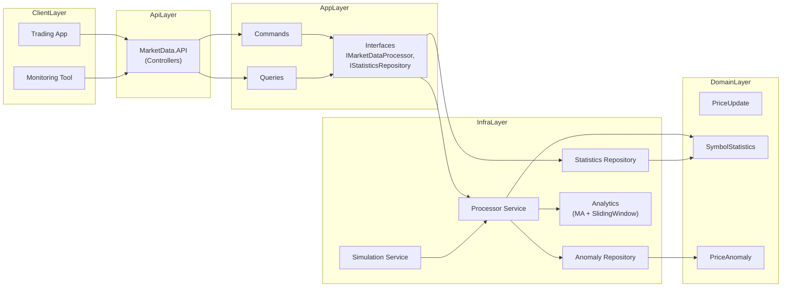
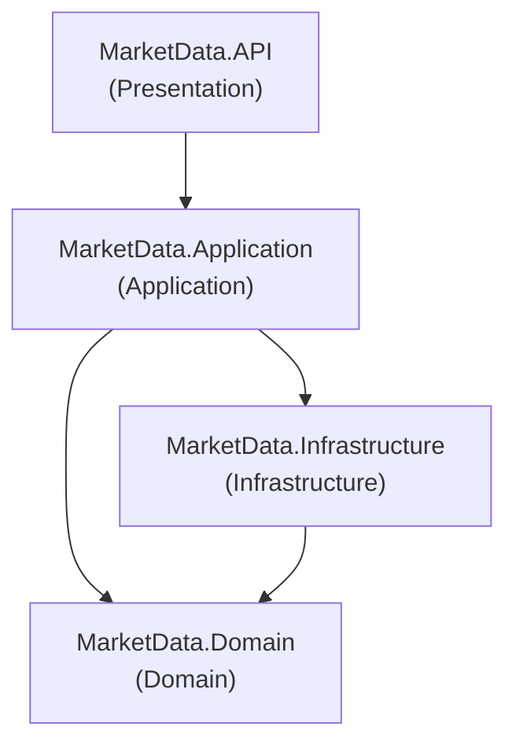
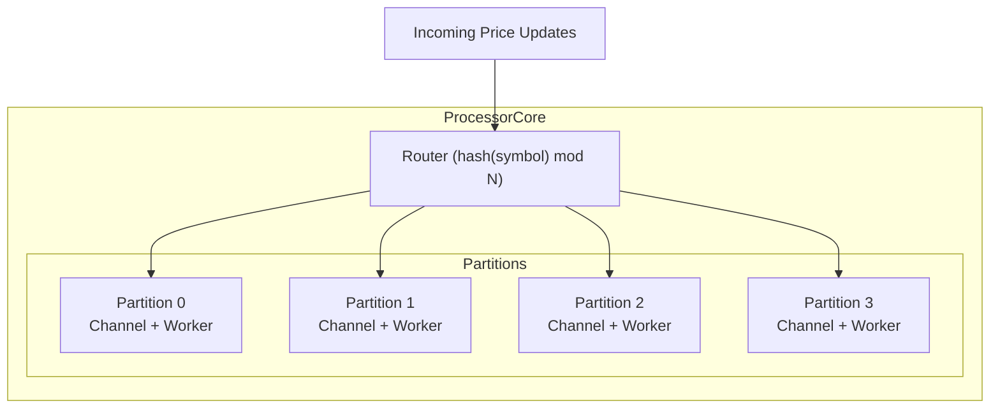
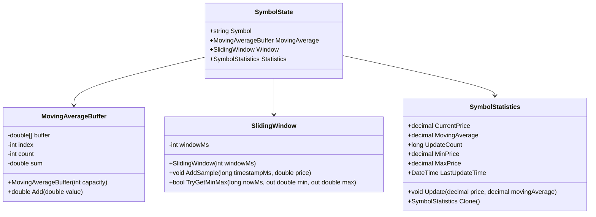

# MarketDataSystem – Combined Architecture Overview

This document gives a **deep, combined view** of the architecture, including:

- High-level data flow
- Layered architecture
- Component interactions
- Partitioning model
- Symbol state internals

---

## 1. High-Level Data Flow

This diagram shows how read and write paths share a common core (`Processor`) but remain decoupled at the API/Application level.

---

## 2. Layered Architecture

We follow a simplified Clean Architecture style. Each project represents a layer.

### 2.1 Project Responsibilities

| Project                  | Responsibility                                              |
|--------------------------|------------------------------------------------------------|
| `MarketData.API`         | HTTP interface, controllers, Swagger / DI wiring.          |
| `MarketData.Application` | Commands, queries, validation, DTOs, interfaces.          |
| `MarketData.Domain`      | Core domain entities and value objects.                   |
| `MarketData.Infrastructure` | Processor, repositories, analytics, simulation.        |

---

## 3. Processor Partitioning

- All updates for a given symbol always go to the **same partition**.
- Each partition has a **single worker** that owns all state updates for its symbols.

---

## 4. SymbolState Internals

---

## 5. Startup Timeline

```mermaid
gantt
    dateFormat  X
    title "Startup & First Tick (Conceptual Timeline)"

    section Host
    "Build Host & DI"           :done, 0, 10
    "Configure Options"         :done, 10, 20
    "Register Hosted Services"  :done, 20, 30

    section Processor
    "Start Processor Workers"   :done, 30, 45

    section Simulation
    "Start Simulation Service"  :done, 45, 60
    "Generate First Ticks"      :done, 60, 80
```

(Values are illustrative – they show the order, not real milliseconds.)

---

## 6. Summary

- Clear separation of concerns (API, Application, Domain, Infrastructure).
- High-throughput pipeline using channels and partitioned workers.
- Efficient data structures for moving averages and sliding windows.
- Dedicated documents in `docs/` dive deeper into performance and testing.
