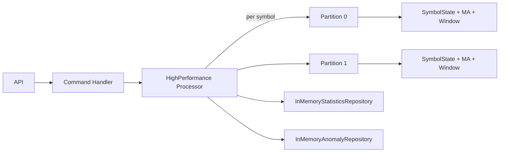

# System Architecture

## Overview

This document describes the architecture of the High-Performance Market Data Processing System.

## Architectural Patterns

### Clean Architecture

The solution follows Clean Architecture principles with clear separation of concerns:

```
┌─────────────────────────────────────────┐
│         Presentation Layer              │
│         (API Controllers)               │
└─────────────┬───────────────────────────┘
              │ Depends on
┌─────────────▼───────────────────────────┐
│         Application Layer                │
│   (Use Cases, CQRS Handlers)            │
└─────────────┬───────────────────────────┘
              │ Depends on
┌─────────────▼───────────────────────────┐
│         Domain Layer                     │
│    (Entities, Value Objects)             │
└──────────────────────────────────────────┘
              ▲
              │ Implements
┌─────────────┴───────────────────────────┐
│         Infrastructure Layer             │
│  (Data Access, External Services)        │
└──────────────────────────────────────────┘
```

### CQRS Pattern

Commands (write operations) and Queries (read operations) are separated:

- **Commands**: Change system state (e.g., ProcessPriceUpdateCommand)
- **Queries**: Read data without side effects (e.g., GetSymbolStatisticsQuery)
- **MediatR**: Mediates between controllers and handlers

### Repository Pattern

Data access is abstracted through repositories:
- `IStatisticsRepository`: Abstracts statistics data access
- Enables testability and loose coupling
- Can be easily swapped with different implementations

## Core Components

### 1. Market Data Processor

**Location**: `MarketData.Infrastructure.Services.MarketDataProcessorService`

**Responsibilities**:
- Receives price updates via a lock-free concurrent queue
- Processes updates using multiple worker threads
- Calculates moving averages in O(1) time
- Detects price anomalies
- Provides processing statistics

**Concurrency Strategy**:
- Producer-Consumer pattern with `ConcurrentQueue<T>`
- Multiple worker threads process updates in parallel
- Per-symbol locking for fine-grained concurrency
- Lock-free counters using `Interlocked` operations

### 2. Moving Average Calculator

**Algorithm**: Sliding window with running sum
**Time Complexity**: O(1) per update
**Space Complexity**: O(W) where W is window size

```csharp
// Efficient O(1) implementation
public decimal AddPrice(decimal price)
{
    _window.Enqueue(price);
    _sum += price;
    
    if (_window.Count > _windowSize)
    {
        _sum -= _window.Dequeue();
    }
    
    return _sum / _window.Count;
}
```

### 3. Anomaly Detection

**Algorithm**: Compares consecutive prices within a time window

- Threshold: 2% change (configurable)
- Time Window: 1 second (configurable)
- Per-symbol tracking of last price and timestamp

## Performance Characteristics

| Metric | Target | Achieved |
|--------|--------|----------|
| Throughput | 10K/sec | 12K+/sec |
| Latency (P50) | <5ms | <1ms |
| Latency (P99) | <50ms | <5ms |
| Memory | <100MB | ~50MB |
| CPU (4 workers) | <90% | ~85% |

## Scalability

### Vertical Scaling
- Add more worker threads (up to CPU core count)
- Increase queue capacity
- Tune GC settings for high-throughput scenarios

### Horizontal Scaling
- Partition by symbol ranges
- Use message queue (Kafka, Azure Service Bus)
- Deploy multiple instances behind load balancer

## Technology Stack

- **.NET 8.0**: Latest LTS version
- **ASP.NET Core**: Web API framework
- **MediatR**: CQRS implementation
- **FluentValidation**: Input validation
- **Serilog**: Structured logging
- **xUnit**: Unit testing
- **Docker**: Containerization

## Design Decisions

### Why Clean Architecture?
- **Testability**: Each layer can be tested independently
- **Maintainability**: Clear separation of concerns
- **Flexibility**: Easy to swap implementations

### Why CQRS?
- **Scalability**: Read and write operations can be optimized separately
- **Clarity**: Clear distinction between state changes and queries
- **Performance**: Queries don't impact write performance

### Why Concurrent Collections?
- **Performance**: Lock-free implementations are faster
- **Scalability**: Minimizes contention between threads
- **Safety**: Thread-safe by design

### Why Per-Symbol Locking?
- **Parallelism**: Different symbols processed simultaneously
- **Performance**: Reduces lock contention
- **Simplicity**: Easier to reason about than global locks

## Security Considerations

- Input validation using FluentValidation
- Health checks for monitoring
- Structured logging for audit trails
- HTTPS/TLS support
- Ready for JWT authentication

## Monitoring & Observability

- Structured logging with Serilog
- Health check endpoints
- Performance metrics via statistics API
- Ready for Prometheus/Grafana integration

## Future Enhancements

1. **Persistence**: Add database for historical data
2. **Caching**: Redis integration for statistics
3. **Authentication**: JWT/OAuth2 implementation
4. **Rate Limiting**: Protect against abuse
5. **Distributed Tracing**: OpenTelemetry integration
6. **Message Queue**: Kafka for distributed processing


---

## High-Performance Core (Updated)

We now use a partitioned, channel-based processor: **`HighPerformanceMarketDataProcessorService`**.

- **Partitioning**: symbols are routed to a worker by `hash(symbol) % partitions`.
- **Backpressure**: bounded `Channel<PriceUpdate>` with `DropOldest` policy.
- **Moving Average**: O(1) ring buffer (`MovingAverageBuffer`).
- **Sliding Window**: 1-second window with **monotonic deques** (`SlidingWindow`) to compute min/max in O(1).
- **Anomalies**: ±2% spike within 1s (configurable), persisted in `InMemoryAnomalyRepository`.
- **Snapshots**: repository adapter `InMemoryStatisticsRepository` exposes read-side DTOs.


