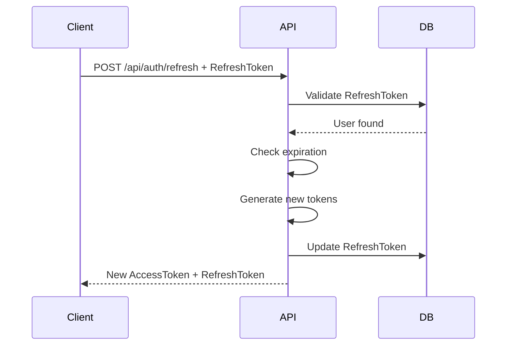

# Authentication & Authorization Guide

This document describes the authentication and authorization system in MarketData.

---

## 📋 Table of Contents

- [Overview](#overview)
- [JWT Authentication](#jwt-authentication)
- [User Roles](#user-roles)
- [Authorization Policies](#authorization-policies)
- [Password Security](#password-security)
- [Token Management](#token-management)
- [Implementation Details](#implementation-details)
- [Security Best Practices](#security-best-practices)

---

## Overview

MarketData uses **JWT (JSON Web Token)** based authentication with **role-based** and **policy-based** authorization.

### Key Features:
- ✅ Secure password hashing with BCrypt
- ✅ JWT access tokens (short-lived, 60 min)
- ✅ Refresh tokens (long-lived, 7 days)
- ✅ Role-based authorization (Admin, User)
- ✅ Policy-based authorization (RequireReadAccess, RequireWriteAccess)
- ✅ Token refresh mechanism
- ✅ Logout with token revocation

---

## JWT Authentication

### Token Structure

JWT tokens contain the following claims:

```json
{
  "sub": "user-id-guid",
  "email": "user@example.com",
  "unique_name": "username",
  "role": "User",
  "jti": "token-id-guid",
  "userId": "user-id-guid",
  "username": "username",
  "nbf": 1699267200,
  "exp": 1699270800,
  "iat": 1699267200,
  "iss": "MarketDataAPI",
  "aud": "MarketDataClients"
}
```

### Token Types

1. **Access Token**
   - Short-lived (60 minutes by default)
   - Used for API authentication
   - Contains user claims and roles
   - Cannot be revoked (expires naturally)

2. **Refresh Token**
   - Long-lived (7 days by default)
   - Used to obtain new access tokens
   - Stored in database
   - Can be revoked (logout)

---

## User Roles

The system supports role-based access control:

### Predefined Roles:

| Role | Description | Permissions |
|------|-------------|-------------|
| **Admin** | System administrator | Full access to all endpoints |
| **User** | Regular user | Read and write access to data endpoints |

### Role Assignment:

Roles are assigned during user registration:

```csharp
// Default role is "User"
var user = new User(username, email, passwordHash, role: "User");

// Admin role must be assigned manually
var admin = new User(username, email, passwordHash, role: "Admin");
```

---

## Authorization Policies

### Built-in Policies:

1. **RequireAdminRole**
   ```csharp
   [Authorize(Policy = "RequireAdminRole")]
   ```
   - Requires `Admin` role
   - Full system access

2. **RequireUserRole**
   ```csharp
   [Authorize(Policy = "RequireUserRole")]
   ```
   - Requires `User` or `Admin` role
   - Standard user access

3. **RequireReadAccess**
   ```csharp
   [Authorize(Policy = "RequireReadAccess")]
   ```
   - Any authenticated user
   - Read-only endpoints

4. **RequireWriteAccess**
   ```csharp
   [Authorize(Policy = "RequireWriteAccess")]
   ```
   - Requires `User` or `Admin` role
   - Write endpoints (POST, PUT, DELETE)

### Policy Configuration

Policies are configured in `Program.cs`:

```csharp
builder.Services.AddAuthorization(options =>
{
    options.AddPolicy("RequireAdminRole",
        policy => policy.RequireRole("Admin"));

    options.AddPolicy("RequireUserRole",
        policy => policy.RequireRole("User", "Admin"));

    options.AddPolicy("RequireReadAccess",
        policy => policy.RequireAuthenticatedUser());

    options.AddPolicy("RequireWriteAccess",
        policy => policy.RequireRole("User", "Admin"));
});
```

---

## Password Security

### BCrypt Hashing

Passwords are hashed using **BCrypt** with automatic salt generation:

```csharp
// Hash password during registration
var passwordHash = BCrypt.Net.BCrypt.HashPassword(password);

// Verify password during login
bool isValid = BCrypt.Net.BCrypt.Verify(password, user.PasswordHash);
```

### Password Requirements:

- Minimum 6 characters
- Recommended: Mix of uppercase, lowercase, numbers, and special characters
- Not stored in plain text
- Salted and hashed with BCrypt (work factor 10)

### Password Change Flow:

1. User provides current password
2. System verifies current password
3. New password is hashed
4. Refresh tokens are revoked (force re-login)
5. Password is updated in database

---

## Token Management

### Token Generation

**JwtTokenService** handles token operations:

```csharp
public class JwtTokenService
{
    public string GenerateAccessToken(User user)
    {
        // Creates JWT with claims
        // Signed with HMAC-SHA256
        // Returns base64 encoded token
    }

    public string GenerateRefreshToken()
    {
        // Generates cryptographically secure random token
        // Returns base64 encoded string
    }

    public ClaimsPrincipal GetPrincipalFromExpiredToken(string token)
    {
        // Validates token structure (ignoring expiration)
        // Returns claims principal for refresh
    }
}
```

### Token Expiration

Configured in `appsettings.json`:

```json
{
  "JwtSettings": {
    "AccessTokenExpirationMinutes": 60,
    "RefreshTokenExpirationDays": 7
  }
}
```

**Environment-specific settings:**
- **Development**: 120 min / 30 days
- **Staging**: 60 min / 7 days
- **Production**: 30 min / 3 days

### Token Refresh Flow



---

## Implementation Details

### AuthenticationService

Main service for authentication operations:

```csharp
public class AuthenticationService
{
    public async Task<AuthResponseDto?> LoginAsync(LoginRequestDto request)
    {
        // 1. Find user by username
        // 2. Verify password with BCrypt
        // 3. Generate access token
        // 4. Generate refresh token
        // 5. Store refresh token in DB
        // 6. Update last login time
        // 7. Return tokens + user info
    }

    public async Task<AuthResponseDto?> RegisterAsync(RegisterRequestDto request)
    {
        // 1. Check username/email uniqueness
        // 2. Hash password with BCrypt
        // 3. Create user entity
        // 4. Save to database
        // 5. Auto-login (generate tokens)
    }

    public async Task<AuthResponseDto?> RefreshTokenAsync(string refreshToken)
    {
        // 1. Find user by refresh token
        // 2. Validate expiration
        // 3. Generate new tokens
        // 4. Update refresh token in DB
        // 5. Return new tokens
    }

    public async Task<bool> LogoutAsync(Guid userId)
    {
        // 1. Find user
        // 2. Clear refresh token
        // 3. Save to database
    }
}
```

### JWT Configuration

JWT authentication is configured in `Program.cs`:

```csharp
builder.Services.AddAuthentication(options =>
{
    options.DefaultAuthenticateScheme = JwtBearerDefaults.AuthenticationScheme;
    options.DefaultChallengeScheme = JwtBearerDefaults.AuthenticationScheme;
})
.AddJwtBearer(options =>
{
    options.TokenValidationParameters = new TokenValidationParameters
    {
        ValidateIssuer = true,
        ValidateAudience = true,
        ValidateLifetime = true,
        ValidateIssuerSigningKey = true,
        ValidIssuer = jwtSettings.Issuer,
        ValidAudience = jwtSettings.Audience,
        IssuerSigningKey = new SymmetricSecurityKey(
            Encoding.UTF8.GetBytes(jwtSettings.SecretKey)
        ),
        ClockSkew = TimeSpan.Zero
    };
});
```

### Middleware Order

**CRITICAL**: Authentication must come before Authorization:

```csharp
app.UseAuthentication();  // MUST be before Authorization
app.UseAuthorization();
```

---

## Security Best Practices

### 1. Secret Key Management

**Development:**
```json
{
  "JwtSettings": {
    "SecretKey": "DEV_SECRET_KEY_FOR_DEVELOPMENT_ONLY_MIN_32_CHARS_LONG"
  }
}
```

**Production:**
Use environment variables or Azure Key Vault:
```bash
export JwtSettings__SecretKey="$(openssl rand -base64 32)"
```

Or Kubernetes Secret:
```yaml
apiVersion: v1
kind: Secret
metadata:
  name: marketdata-secrets
data:
  jwt-secret-key: <base64-encoded-key>
```

### 2. HTTPS Only

Always use HTTPS in production:
```csharp
app.UseHttpsRedirection();
```

### 3. Secure Headers

Add security headers:
```csharp
app.Use(async (context, next) =>
{
    context.Response.Headers.Add("X-Content-Type-Options", "nosniff");
    context.Response.Headers.Add("X-Frame-Options", "DENY");
    context.Response.Headers.Add("X-XSS-Protection", "1; mode=block");
    await next();
});
```

### 4. Rate Limiting

Protect authentication endpoints from brute force:
```json
{
  "IpRateLimiting": {
    "GeneralRules": [
      {
        "Endpoint": "*/api/auth/login",
        "Period": "1m",
        "Limit": 5
      }
    ]
  }
}
```

### 5. Token Rotation

Refresh tokens are rotated on each use:
- Old refresh token is invalidated
- New refresh token is generated
- Prevents replay attacks

### 6. Audit Logging

Log authentication events:
```csharp
_logger.LogInformation("User {Username} logged in successfully", username);
_logger.LogWarning("Failed login attempt for {Username}", username);
```

---

## Testing Authentication

### Unit Tests

```csharp
[Fact]
public void GenerateAccessToken_ShouldReturnValidToken()
{
    var user = new User("testuser", "test@example.com", "hash", "User");
    var token = _jwtService.GenerateAccessToken(user);

    token.Should().NotBeNullOrEmpty();
    token.Split('.').Should().HaveCount(3); // JWT format
}
```

### Integration Tests

```csharp
[Fact]
public async Task Login_ShouldReturn200_WithValidCredentials()
{
    var response = await _client.PostAsJsonAsync("/api/auth/login",
        new { username = "testuser", password = "Test@123" });

    response.StatusCode.Should().Be(HttpStatusCode.OK);
    var authResponse = await response.Content.ReadFromJsonAsync<AuthResponseDto>();
    authResponse.AccessToken.Should().NotBeNullOrEmpty();
}
```

---

## Troubleshooting

### Common Issues

#### 1. "Unauthorized" on Protected Endpoints

**Problem**: 401 response even with token

**Solutions**:
- Check token in Authorization header: `Bearer <token>`
- Verify token hasn't expired
- Ensure middleware order (Authentication before Authorization)
- Check JWT secret key matches

#### 2. Token Validation Errors

**Problem**: Token signature invalid

**Solutions**:
- Verify `JwtSettings__SecretKey` is set correctly
- Check Issuer and Audience match configuration
- Ensure key is at least 32 characters

#### 3. Refresh Token Not Working

**Problem**: Refresh returns 401

**Solutions**:
- Check refresh token hasn't expired
- Verify token exists in database
- Ensure user is still active

---

## API Endpoints Summary

| Endpoint | Method | Auth | Description |
|----------|--------|------|-------------|
| `/api/auth/register` | POST | Public | Register new user |
| `/api/auth/login` | POST | Public | Login and get tokens |
| `/api/auth/refresh` | POST | Public | Refresh access token |
| `/api/auth/me` | GET | Required | Get current user |
| `/api/auth/logout` | POST | Required | Logout user |
| `/api/auth/change-password` | POST | Required | Change password |

---

## Default Test Accounts

After running database migrations:

| Username | Password | Role |
|----------|----------|------|
| admin | Admin@123 | Admin |
| demo | Demo@123 | User |

**⚠️ IMPORTANT**: Change these passwords in production!

---

## Configuration Reference

### appsettings.json

```json
{
  "JwtSettings": {
    "SecretKey": "YOUR_SECRET_KEY_MIN_32_CHARS",
    "Issuer": "MarketDataAPI",
    "Audience": "MarketDataClients",
    "AccessTokenExpirationMinutes": 60,
    "RefreshTokenExpirationDays": 7
  }
}
```

### Environment Variables

```bash
JwtSettings__SecretKey=<your-secret-key>
JwtSettings__Issuer=MarketDataAPI
JwtSettings__Audience=MarketDataClients
JwtSettings__AccessTokenExpirationMinutes=60
JwtSettings__RefreshTokenExpirationDays=7
```

---

## Further Reading

- [JWT.io](https://jwt.io/) - JWT debugger and documentation
- [BCrypt](https://github.com/BcryptNet/bcrypt.net) - Password hashing library
- [ASP.NET Core Authentication](https://docs.microsoft.com/en-us/aspnet/core/security/authentication/)
- [ASP.NET Core Authorization](https://docs.microsoft.com/en-us/aspnet/core/security/authorization/)

---

**Last Updated:** 2025-11-06
