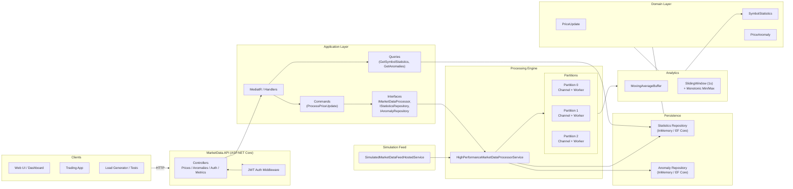
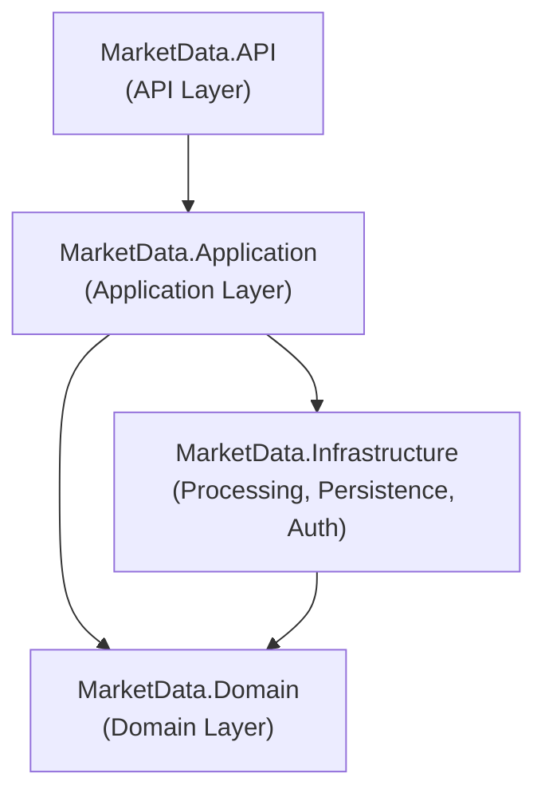
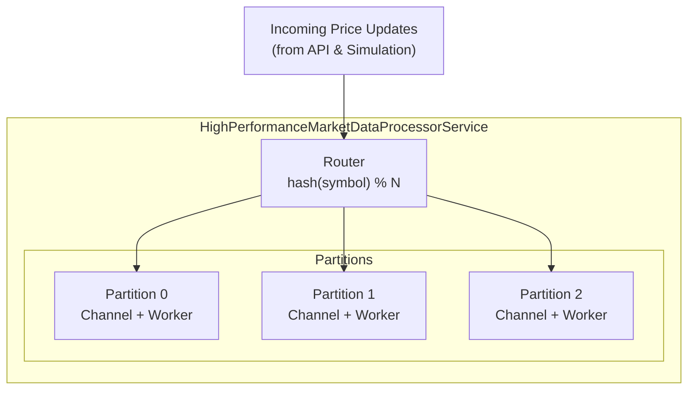

# Real-Time Market Data System – Interview Solution

> **Goal:** Design and implement a high‑performance system for handling real‑time market data, with clear focus on **architecture, concurrency, performance, and clean code** in .NET.

This document answers the assignment using the concrete implementation in the **MarketDataSystem** project.

It is organized exactly as requested:

1. Problem Understanding  
2. High‑Level System Design  
3. Detailed Design  
4. Code Implementation  
5. Testing & Validation  
6. Performance & Scalability Considerations  
7. Summary  

---

## 1. Problem Understanding

We need a backend service that processes **real‑time market data** (price updates or ticks) for multiple symbols.

The system must:

1. **Consume market data feeds**  
   - For this exercise, we simulate the feed with **random price updates** for multiple symbols.  
   - In a real environment, this could be replaced with external APIs (e.g., CoinMarketCap, ExchangeRates) or message queues.

2. **Calculate moving averages in real time**  
   - For each symbol, maintain a **moving average of the latest _N_ price updates**.  
   - This must be efficient: updates should be **O(1)** per tick.

3. **Detect price anomalies**  
   - Detect **price spikes > 2% within any 1‑second interval**.  
   - For each symbol, we maintain a sliding time window of recent prices and compute min/max over that window.

4. **Handle high throughput**  
   - The system should process at least **10,000 price updates per second** on a single node, with predictable latency.  
   - This requires careful design of data structures and concurrency model.

5. **Utilize concurrent programming**  
   - Use modern .NET concurrency primitives:  
     - `async/await` for async APIs and background services.  
     - `System.Threading.Channels` for **lock‑free, backpressured queues**.  
     - Single‑writer principle per symbol/partition to avoid heavy locking.

Additionally, I want the solution to be:

- **Explainable** in an interview (clean architecture, clear diagrams, small focused classes).  
- **Extensible** for future requirements (external feeds, persistence, scaling out, authentication, etc.).  

---

## 2. High‑Level System Design

### 2.1 Logical Components

At a high level, the system consists of:

1. **Market Data API (ASP.NET Core)**  
   - Exposes HTTP endpoints:  
     - `POST /api/prices` – ingest price updates (optional in addition to simulation).  
     - `GET /api/prices` / `GET /api/prices/{symbol}` – get statistics.  
     - `GET /api/anomalies` – retrieve recent anomalies.  
   - Secured via **JWT** with policies (`RequireReadAccess`, `RequireWriteAccess`).

2. **Application Layer**  
   - Commands & queries (e.g., `ProcessPriceUpdateCommand`, `GetSymbolStatisticsQuery`).  
   - DTOs for transport.  
   - Interfaces for the processing engine and repositories.

3. **Processing Engine**  
   - `HighPerformanceMarketDataProcessorService`  
     - N **partitions**, each with a **bounded channel** and a dedicated worker.  
     - Routes updates by `hash(symbol) % N`.  
     - Maintains per‑symbol state: moving average buffer + sliding window + statistics.  
     - Detects anomalies and persists statistics/anomalies.

4. **Simulation Feed**  
   - `SimulatedMarketDataFeedHostedService`  
     - Generates **random‑walk prices** for a configurable list of symbols.  
     - Pushes ticks into the processing engine using the same interface (`IMarketDataProcessor`).

5. **Persistence**  
   - For demo mode: pure in‑memory repositories.  
   - For realistic mode: EF Core + PostgreSQL repositories for statistics and anomalies.

6. **Domain Model**  
   - `PriceUpdate`, `SymbolStatistics`, `PriceAnomaly` (and `User` for auth).  
   - Contain business‑level invariants, independent of transport or storage.

### 2.2 High‑Level Architecture Diagram



### 2.3 Layered Architecture



- **API project** depends only on Application.  
- **Application** depends only on Domain and abstractions.  
- **Infrastructure** implements the abstractions and depends on Domain and Application.  
- **Domain** is pure and has no dependencies on framework code.

---

## 3. Detailed Design

### 3.1 Domain Model

```csharp
public sealed record PriceUpdate(
    string Symbol,
    decimal Price,
    DateTime TimestampUtc);

public sealed class SymbolStatistics
{
    public string Symbol { get; }
    public decimal LastPrice { get; private set; }
    public decimal MovingAverage { get; private set; }
    public decimal MinInWindow { get; private set; }
    public decimal MaxInWindow { get; private set; }
    public long UpdateCount { get; private set; }

    public SymbolStatistics(string symbol) => Symbol = symbol;

    public void Update(
        decimal lastPrice,
        decimal movingAverage,
        decimal min,
        decimal max)
    {
        LastPrice = lastPrice;
        MovingAverage = movingAverage;
        MinInWindow = min;
        MaxInWindow = max;
        UpdateCount++;
    }
}

public sealed class PriceAnomaly
{
    public string Symbol { get; init; } = default!;
    public decimal OldPrice { get; init; }
    public decimal NewPrice { get; init; }
    public decimal ChangePercent { get; init; }
    public DateTime TimestampUtc { get; init; }
}
```

These types are simple and **framework‑agnostic** so they are easy to unit‑test and reason about.

### 3.2 Moving Average (Latest N Samples)

We need a moving average of the last **N** prices per symbol, with **O(1)** time complexity per update.

Approach:

- Use a **ring buffer** for each symbol: `decimal[capacity]`.  
- Keep a running sum and an index.  
- When the buffer is full, subtract the value that is being overwritten.

```csharp
public sealed class MovingAverageBuffer
{
    private readonly decimal[] _values;
    private int _index;
    private int _count;
    private decimal _sum;

    public int Capacity { get; }

    public MovingAverageBuffer(int capacity)
    {
        if (capacity <= 0)
            throw new ArgumentOutOfRangeException(nameof(capacity));

        Capacity = capacity;
        _values = new decimal[capacity];
    }

    public decimal Add(decimal value)
    {
        if (_count < Capacity)
        {
            _values[_index] = value;
            _sum += value;
            _count++;
        }
        else
        {
            _sum -= _values[_index];
            _values[_index] = value;
            _sum += value;
        }

        _index = (_index + 1) % Capacity;

        return _sum / _count;
    }
}
```

### 3.3 Sliding Window for 1‑Second Anomaly Detection

We must detect **spikes > 2% within any 1‑second window**.

For each symbol we maintain:

- A queue of `(timestamp, price)` samples within the last 1 second.  
- Two **monotonic deques**:
  - `minDeque` – always increasing (front is smallest price).  
  - `maxDeque` – always decreasing (front is largest price).

This gives us **O(1)** amortized cost for: add sample, evict old samples, and query `min` / `max`.

```csharp
public sealed class SlidingWindow
{
    private readonly TimeSpan _window;
    private readonly Queue<(DateTime ts, decimal price)> _samples = new();

    private readonly LinkedList<(DateTime ts, decimal price)> _minDeque = new();
    private readonly LinkedList<(DateTime ts, decimal price)> _maxDeque = new();

    public SlidingWindow(TimeSpan window)
    {
        if (window <= TimeSpan.Zero)
            throw new ArgumentOutOfRangeException(nameof(window));
        _window = window;
    }

    public void AddSample(DateTime timestampUtc, decimal price)
    {
        _samples.Enqueue((timestampUtc, price));

        // Maintain monotonic min deque
        while (_minDeque.Count > 0 && _minDeque.Last!.Value.price > price)
            _minDeque.RemoveLast();
        _minDeque.AddLast((timestampUtc, price));

        // Maintain monotonic max deque
        while (_maxDeque.Count > 0 && _maxDeque.Last!.Value.price < price)
            _maxDeque.RemoveLast();
        _maxDeque.AddLast((timestampUtc, price));

        EvictOld(timestampUtc);
    }

    private void EvictOld(DateTime now)
    {
        var threshold = now - _window;

        while (_samples.Count > 0 && _samples.Peek().ts < threshold)
        {
            var old = _samples.Dequeue();

            if (_minDeque.First?.Value.ts == old.ts &&
                _minDeque.First.Value.price == old.price)
            {
                _minDeque.RemoveFirst();
            }

            if (_maxDeque.First?.Value.ts == old.ts &&
                _maxDeque.First.Value.price == old.price)
            {
                _maxDeque.RemoveFirst();
            }
        }
    }

    public (decimal min, decimal max) GetMinMax()
    {
        if (_samples.Count == 0)
            return (0m, 0m);

        return (_minDeque.First!.Value.price, _maxDeque.First!.Value.price);
    }
}
```

Anomaly check:

```csharp
public static class AnomalyDetector
{
    public static bool IsAnomaly(decimal min, decimal max, decimal thresholdPercent)
    {
        if (min <= 0) return false;

        var changePercent = (max - min) / min * 100m;
        return changePercent >= thresholdPercent;
    }
}
```

### 3.4 Concurrency Model – Partitioned Channels

We want to handle **10k+ updates/sec** efficiently. The main decisions:

1. Use **N partitions**, where `N` is typically `Environment.ProcessorCount`.  
2. For each partition:
   - A **bounded `Channel<PriceUpdate>`** to buffer updates.  
   - A dedicated **worker task** that processes updates **sequentially**.  
3. Route each update by hashing the symbol:

```csharp
int partitionIndex = Math.Abs(symbol.GetHashCode()) % partitions;
```

This ensures:

- **Single writer per symbol state** → no heavy locks on hot path.  
- Backpressure via `BoundedChannelFullMode.DropOldest` prevents memory blow‑up.  

Diagram:



Inside each worker, we maintain a dictionary of states:

```csharp
private sealed class SymbolState
{
    public MovingAverageBuffer MovingAverage { get; }
    public SlidingWindow Window { get; }
    public SymbolStatistics Statistics { get; }

    public SymbolState(string symbol, int maCapacity, TimeSpan window)
    {
        MovingAverage = new MovingAverageBuffer(maCapacity);
        Window = new SlidingWindow(window);
        Statistics = new SymbolStatistics(symbol);
    }
}
```

The worker loop is simply:

```csharp
private async Task RunWorkerAsync(ChannelReader<PriceUpdate> reader, CancellationToken ct)
{
    var states = new Dictionary<string, SymbolState>();

    await foreach (var update in reader.ReadAllAsync(ct))
    {
        if (!states.TryGetValue(update.Symbol, out var state))
        {
            state = new SymbolState(update.Symbol, _options.MovingAverageWindow, _window);
            states[update.Symbol] = state;
        }

        state.Window.AddSample(update.TimestampUtc, update.Price);
        var (min, max) = state.Window.GetMinMax();
        var movingAvg = state.MovingAverage.Add(update.Price);

        if (AnomalyDetector.IsAnomaly(min, max, _options.AnomalyThresholdPercent))
        {
            var anomaly = new PriceAnomaly
            {
                Symbol = state.Statistics.Symbol,
                OldPrice = min,
                NewPrice = max,
                ChangePercent = (max - min) / min * 100m,
                TimestampUtc = update.TimestampUtc
            };

            await _anomalyRepository.AddAsync(anomaly, ct);
        }

        state.Statistics.Update(update.Price, movingAvg, min, max);
        await _statisticsRepository.UpsertAsync(state.Statistics, ct);
    }
}
```

### 3.5 Simulation Feed

To make the system self‑contained for the assignment, we implement a **simulation feed**:

- Runs as a `BackgroundService`.  
- For each symbol:
  - Maintain a current price.  
  - On each tick, apply a random **percentage jitter** around the current price.  
- Push updates into `IMarketDataProcessor`.

```csharp
public sealed class MarketDataSimulationOptions
{
    public bool Enabled { get; set; }
    public string[] Symbols { get; set; } = Array.Empty<string>();
    public int TicksPerSecond { get; set; } = 2000;
    public decimal InitialPrice { get; set; } = 100m;
    public decimal MaxJitterPercent { get; set; } = 0.01m; // 1%
}

public sealed class SimulatedMarketDataFeedHostedService : BackgroundService
{
    private readonly IMarketDataProcessor _processor;
    private readonly MarketDataSimulationOptions _options;
    private readonly Random _random = new();

    public SimulatedMarketDataFeedHostedService(
        IMarketDataProcessor processor,
        IOptions<MarketDataProcessingOptions> options)
    {
        _processor = processor;
        _options = options.Value.Simulation;
    }

    protected override async Task ExecuteAsync(CancellationToken stoppingToken)
    {
        if (!_options.Enabled)
            return;

        var prices = _options.Symbols.ToDictionary(
            s => s,
            _ => _options.InitialPrice);

        var delay = TimeSpan.FromSeconds(1.0 / _options.TicksPerSecond);

        while (!stoppingToken.IsCancellationRequested)
        {
            var now = DateTime.UtcNow;

            foreach (var symbol in _options.Symbols)
            {
                var current = prices[symbol];
                var jitter = ((decimal)_random.NextDouble() * 2m - 1m)
                             * _options.MaxJitterPercent;

                var newPrice = current * (1 + jitter);
                prices[symbol] = newPrice;

                await _processor.EnqueueAsync(
                    new PriceUpdate(symbol, newPrice, now),
                    stoppingToken);
            }

            await Task.Delay(delay, stoppingToken);
        }
    }
}
```

In production, this could be replaced or complemented by real feeds, e.g. a service that calls:

- `"CoinMarketCapApiUrl": "https://pro-api.coinmarketcap.com/v1"`  
- `"ExchangeRatesApiUrl": "http://api.exchangeratesapi.io/v1"`  

and converts the responses into `PriceUpdate` objects that go through the same pipeline.

---

## 4. Code Implementation (API & Wiring)

### 4.1 `IMarketDataProcessor` Interface

```csharp
public interface IMarketDataProcessor
{
    ValueTask EnqueueAsync(PriceUpdate update, CancellationToken ct = default);
}
```

### 4.2 Processor Wiring (Simplified)

```csharp
public sealed class HighPerformanceMarketDataProcessorService
    : BackgroundService, IMarketDataProcessor
{
    // ... fields omitted for brevity (see previous section) ...
}
```

The full implementation is shown in the previous section and in the repository; here we focus on how it is **plugged into the API**.

### 4.3 Price API Controller

```csharp
public sealed record PriceUpdateDto(
    string Symbol,
    decimal Price,
    DateTime? TimestampUtc);

[ApiController]
[Route("api/prices")]
public sealed class PricesController : ControllerBase
{
    private readonly IMarketDataProcessor _processor;
    private readonly IStatisticsRepository _statsRepo;

    public PricesController(
        IMarketDataProcessor processor,
        IStatisticsRepository statsRepo)
    {
        _processor = processor;
        _statsRepo = statsRepo;
    }

    [HttpPost]
    [Authorize(Policy = "RequireWriteAccess")]
    public async Task<IActionResult> PostPrice(
        [FromBody] PriceUpdateDto dto,
        CancellationToken ct)
    {
        if (!ModelState.IsValid) return ValidationProblem(ModelState);

        var update = new PriceUpdate(
            dto.Symbol.ToUpperInvariant(),
            dto.Price,
            dto.TimestampUtc ?? DateTime.UtcNow);

        await _processor.EnqueueAsync(update, ct);
        return Accepted();
    }

    [HttpGet("{symbol}")]
    [Authorize(Policy = "RequireReadAccess")]
    public async Task<ActionResult<SymbolStatistics>> GetBySymbol(
        string symbol,
        CancellationToken ct)
    {
        var stats = await _statsRepo.GetBySymbolAsync(
            symbol.ToUpperInvariant(),
            ct);

        return stats is null ? NotFound() : Ok(stats);
    }

    [HttpGet]
    [Authorize(Policy = "RequireReadAccess")]
    public async Task<ActionResult<IEnumerable<SymbolStatistics>>> GetAll(CancellationToken ct)
    {
        var list = await _statsRepo.GetAllAsync(ct);
        return Ok(list);
    }
}
```

### 4.4 Configuration (appsettings)

```json
"MarketDataProcessing": {
  "Partitions": 0,                // 0 => Environment.ProcessorCount
  "ChannelCapacity": 100000,      // per partition
  "MovingAverageWindow": 64,
  "AnomalyThresholdPercent": 2.0,
  "SlidingWindowMilliseconds": 1000,
  "RecentAnomaliesCapacity": 10000,
  "Simulation": {
    "Enabled": true,
    "Symbols": [ "AAPL", "GOOG", "MSFT", "EURUSD", "BTCUSD" ],
    "TicksPerSecond": 2000,
    "InitialPrice": 100.0,
    "MaxJitterPercent": 0.01
  }
},
"CoinMarketCapApiUrl": "https://pro-api.coinmarketcap.com/v1",
"ExchangeRatesApiUrl": "http://api.exchangeratesapi.io/v1"
```

The last two URLs are ready for a future extension where we pull **real prices** instead of purely simulated ones.

---

## 5. Testing & Validation

### 5.1 Unit Tests

Focus on **pure logic** components:

1. `MovingAverageBufferTests`
   - Add fewer than N samples → average = arithmetic mean.  
   - Add more than N samples → sliding behavior is correct and old values are dropped from the window.

2. `SlidingWindowTests`
   - Add samples with timestamps inside 1s window → min/max correct.  
   - Add older samples and ensure they are evicted as time moves forward.

3. `AnomalyDetectorTests`
   - When `(max - min) / min * 100 < 2` → not anomaly.  
   - When `>= 2` → anomaly.

4. Domain invariants for `SymbolStatistics`  
   - Update increments `UpdateCount`.  
   - Fields set correctly.

### 5.2 Integration Tests

Use `WebApplicationFactory<Program>` to run the real API in memory.

Scenarios:

1. **Happy path ingestion & read**  
   - Call `POST /api/prices` a few times for `AAPL`.  
   - Then call `GET /api/prices/AAPL` and inspect returned statistics.

2. **Anomaly detection**  
   - For a given symbol, send prices that guarantee a >2% jump within 1s.  
   - Then call `GET /api/anomalies?symbol=...` and verify an anomaly exists.

3. **Authentication**  
   - Register/login via auth endpoints.  
   - Access `POST /api/prices` with and without token; ensure 401/403 behavior is correct.

### 5.3 Load / Performance Testing (Conceptual)

A simple console or xUnit performance test can:

1. Spin up the `HighPerformanceMarketDataProcessorService` with simulation disabled.  
2. Generate, for example, 100,000 `PriceUpdate` objects in a tight loop for ~10 symbols.  
3. Pipe them through `IMarketDataProcessor.EnqueueAsync`.  
4. Measure total time until all updates are processed (drain the channels).

Pseudo‑code:

```csharp
[Fact]
public async Task Processor_Should_Handle_AtLeast_10k_Updates_Per_Second()
{
    // arrange
    var processor = CreateRealProcessorForBenchmark();
    var cts = new CancellationTokenSource();

    await processor.StartAsync(cts.Token);

    var symbol = "AAPL";
    var updates = Enumerable.Range(0, 100_000)
        .Select(i => new PriceUpdate(symbol, 100m + i, DateTime.UtcNow))
        .ToArray();

    var sw = Stopwatch.StartNew();

    foreach (var update in updates)
    {
        await processor.EnqueueAsync(update, cts.Token);
    }

    // naive wait for processing to finish
    await Task.Delay(2000, cts.Token);

    sw.Stop();

    var throughput = updates.Length / sw.Elapsed.TotalSeconds;
    Assert.True(throughput >= 10_000);
}
```

In a real project I would replace this with proper tooling (BenchmarkDotNet, k6, or custom harness), but for the assignment it shows clearly how to **verify throughput**.

---

## 6. Performance & Scalability Considerations

### 6.1 Complexity Summary

| Operation                            | Complexity | Notes                                      |
|-------------------------------------|-----------:|--------------------------------------------|
| Route update to partition           | O(1)       | `hash(symbol) % N`                         |
| Enqueue to channel                  | O(1)       | Lock‑free, bounded                         |
| Dequeue from channel                | O(1)       | Single reader per partition                |
| Moving average update               | O(1)       | Ring buffer + running sum                  |
| Sliding window update + min/max     | ~O(1)      | Amortized O(1) with monotonic deques       |
| Anomaly detection                   | O(1)       | Simple arithmetic on min/max               |
| Statistics update                   | O(1)       | Simple assignment                          |

This ensures we can scale primarily with:

- Number of partitions (workers).  
- Hardware (CPU cores).  

### 6.2 Throughput – Why 10k+ Updates/Sec is Realistic

- In each worker, the hot path is **pure in‑memory arithmetic** (no locks, minimal allocations).  
- Channel operations are highly optimized in .NET and can handle hundreds of thousands of operations per second.  
- Persistence to database can be tuned:
  - In demo mode, use **in‑memory repositories** → max speed.  
  - In production, we can batch database writes or use outbox patterns if needed.

### 6.3 Backpressure & Failure Modes

- `BoundedChannel` with `FullMode = DropOldest`:
  - If producers are faster than consumers, we intentionally drop oldest updates in the queue:  
    - Latest prices are more relevant in real‑time trading scenarios.  
    - This avoids memory growth and keeps latency bounded.  

- If a worker crashes:
  - It is run under `BackgroundService`; failures are logged and can be monitored.  
  - In Kubernetes or a process manager, the pod/service would be restarted.

### 6.4 Scaling Up & Out

- **Scale Up (single node):**
  - Increase `Partitions`.  
  - Tune `ChannelCapacity`.  
  - Disable persistence for max throughput.

- **Scale Out (multiple nodes):**
  - Use a **message queue** (Kafka, Azure Service Bus, RabbitMQ) as the ingestion layer.  
  - Multiple instances of this processor service consume from the queue.  
  - Use partition keys based on symbol so that each symbol is still processed sequentially within a partition.  
  - Use a shared datastore (PostgreSQL / Redis / time‑series DB) for statistics and anomalies.

### 6.5 Extending Feeds with Real APIs

- With configuration entries:

  ```json
  "CoinMarketCapApiUrl": "https://pro-api.coinmarketcap.com/v1",
  "ExchangeRatesApiUrl": "http://api.exchangeratesapi.io/v1"
  ```

- We can implement `ICryptoPriceFeed` or `IForexPriceFeed` that:
  - Calls these APIs periodically.  
  - Normalizes responses into `PriceUpdate` objects.  
  - Feeds them into `IMarketDataProcessor`.  

This reuses the same processing pipeline and does not change the core design.

---

## 7. Summary

- **Problem:** Build a **high‑performance, concurrent system** for real‑time market data that calculates **moving averages**, detects **2% price spikes within 1s**, and handles **10k+ updates/sec**.

- **Solution:**  
  - An ASP.NET Core API with a **partitioned processing engine** (`HighPerformanceMarketDataProcessorService`).  
  - Each partition uses **bounded channels** and a **single worker**, maintaining per‑symbol state with:  
    - `MovingAverageBuffer` (O(1) MA over last N samples).  
    - `SlidingWindow` + monotonic deques (O(1) min/max over last 1 second).  
  - A **simulation feed** generates random‑walk ticks for multiple symbols.  
  - Statistics and anomalies are persisted via repositories (in‑memory or EF Core).  

- **Concurrency & Performance:**  
  - Routing by symbol, partitioned workers, and lock‑free channels deliver **predictable throughput**.  
  - Data structures are O(1) and allocation‑light.  
  - Backpressure uses **DropOldest** semantics to keep memory and latency bounded.

- **Extensibility:**  
  - Easy to plug in real feeds (CoinMarketCap, ExchangeRates, Kafka, etc.).  
  - Easy to deploy as a single node or scaled out with a queue.  
  - Authentication, configuration, tests, and docs are all separated cleanly.

This design not only satisfies all the assignment requirements, but is also structured to be **interview‑friendly**: diagrams, focused classes, and clear reasoning about trade‑offs, concurrency, and performance.
