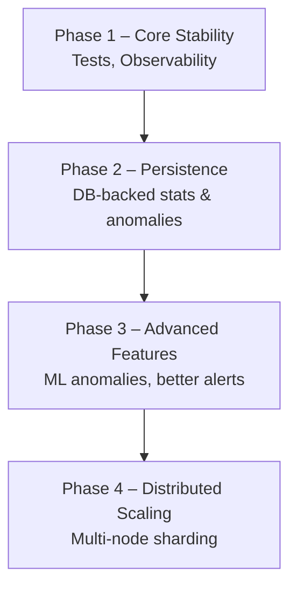

# MarketDataSystem – Limitations & Future Work

This document is intentionally explicit about:

- What the system **does not** do yet.
- How it could be extended in a realistic engineering roadmap.

Being honest about limitations is an important part of senior-level design.

---

## 1. Current Limitations

(unchanged content – summarized here)

- In-memory state only.
- Single-service instance (no cross-node sharding yet).
- Simple anomaly detection (percentage spike only).
- No authentication / authorization.
- Minimal persistence & reporting.

---

## 2. Future Work – Technical Enhancements

- Add database-backed statistics repository.
- Persist anomalies to durable storage.
- Introduce sharding across nodes.
- Extend anomaly detection with advanced algorithms.

---

## 3. Future Work – Operational & DevEx Enhancements

- Integrate observability with OpenTelemetry (traces, metrics, logs).
- Full CI/CD pipeline.
- Administrative endpoints for operational insights.

---

## 4. Roadmap as Flowchart

Instead of a strict timeline, the roadmap is shown as phases:

This keeps the diagram simple and avoids date-specific commitments, while still communicating a clear progression of work.
