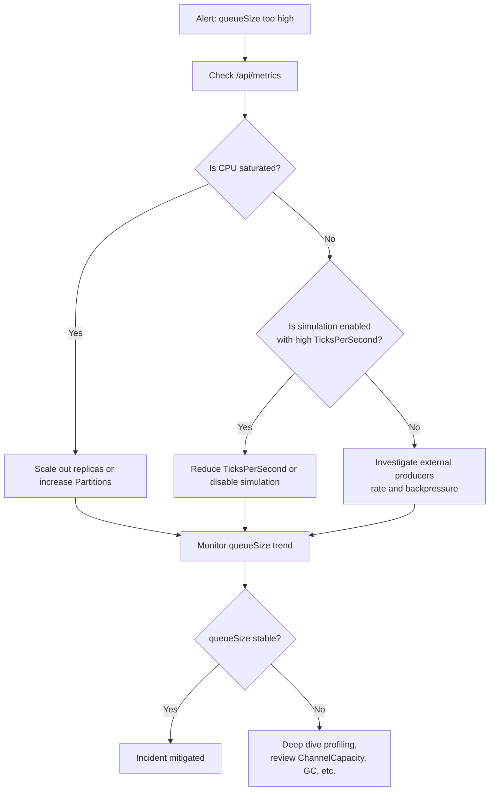

# MarketDataSystem – Operations Runbook

This document explains how to **run**, **monitor**, and **troubleshoot** the MarketDataSystem in a production-like environment.

---

## 1. Starting the Service

### 1.1 Local Development

From the API project directory:

```bash
cd src/MarketData.API
dotnet restore
dotnet run
```

The application will:

- Start the ASP.NET Core API,
- Start the `HighPerformanceMarketDataProcessorService` hosted service,
- Optionally start the `SimulatedMarketDataFeedHostedService` (if enabled in config).

### 1.2 Docker (Example)

If a Dockerfile exists (or you add one), basic pattern:

```bash
docker build -t market-data-api .
docker run -p 8080:8080 market-data-api
```

Configuration can be passed via environment variables or mounted config files.

---

## 2. Configuration Management

Core options are under the `MarketDataProcessing` section in `appsettings.json`:

- `Partitions` – number of partitions (workers).
- `ChannelCapacity` – bounded channel capacity.
- `MovingAverageWindow` – window size for moving average.
- `AnomalyThresholdPercent` – spike threshold (e.g., 2.0).
- `SlidingWindowMilliseconds` – length of sliding time window (e.g., 1000).
- `RecentAnomaliesCapacity` – max anomalies stored in memory.
- `Simulation` – sub-object controlling simulated feed.

### Example (snippet):

```json
{
  "MarketDataProcessing": {
    "Partitions": 0,
    "ChannelCapacity": 100000,
    "MovingAverageWindow": 64,
    "AnomalyThresholdPercent": 2.0,
    "SlidingWindowMilliseconds": 1000,
    "RecentAnomaliesCapacity": 10000,
    "Simulation": {
      "Enabled": true,
      "Symbols": ["AAPL","GOOG","MSFT","EURUSD","BTCUSD"],
      "TicksPerSecond": 2000,
      "InitialPrice": 100.0,
      "MaxJitterPercent": 0.01
    }
  }
}
```

In production, this should be externalized (environment variables, KeyVault, ConfigMaps, etc.).

---

## 3. Health & Monitoring

### 3.1 Health Endpoint

- `GET /health` – returns HTTP 200 when the service is up.

Use this for:

- Kubernetes liveness/readiness probes.
- Monitoring systems that need to know if the service is running.

### 3.2 Metrics Endpoint (Internal)

- `GET /api/metrics` – returns:

  - `totalProcessedTicks`
  - `anomaliesDetected`
  - `activeSymbols`
  - `queueSize`
  - (Potentially throughput, depending on implementation)

You can scrape this endpoint periodically to build simple dashboards.

---

## 4. Key Signals to Watch

| Signal            | Source            | What It Means                                          |
|-------------------|-------------------|--------------------------------------------------------|
| API latency       | HTTP logs / APM   | Overall responsiveness of the service                 |
| `/api/metrics`    | Metrics endpoint  | Internal throughput & anomaly rate                    |
| `queueSize`       | Metrics endpoint  | Backlog in channels; high values = potential overload |
| `activeSymbols`   | Metrics endpoint  | Number of symbols currently tracked                   |
| HTTP 5xx count    | Logs / APM        | Error rate from the API                               |
| `/health` failures| Health endpoint   | Process is down or misbehaving                        |

---

## 5. Troubleshooting Scenarios

### 5.1 High Latency on Writes (POST /api/prices)

Possible causes:

- API under heavy CPU load (too many concurrent requests).
- Processor partitions overloaded:
  - `queueSize` growing continuously.
  - Total processed not keeping up with incoming rate.

Actions:

- Check CPU utilization.
- Increase `Partitions` (more workers).
- Scale out more instances (horizontal scaling).
- Decrease `TicksPerSecond` of simulated feed (if using).

### 5.2 Anomaly Rate Spikes

Possible causes:

- Market actually unstable (in real scenario).
- Simulation jitter too high (in demo mode).
- Misconfigured `AnomalyThresholdPercent`.

Actions:

- Check simulation settings.
- Check symbol-specific patterns using `/api/anomalies?symbol=...`.
- Adjust `AnomalyThresholdPercent` or window length.

### 5.3 Memory Growth

Possible causes:

- Too many symbols (unbounded symbol universe).
- `RecentAnomaliesCapacity` too large.

Actions:

- Consider limiting allowed symbols.
- Reduce `RecentAnomaliesCapacity`.
- Use external persistence for anomalies and store fewer in memory.

---

## 6. Operational Procedures

### 6.1 Rolling Restart

If running multiple instances:

1. Remove instance from load balancer.
2. Wait for in-flight requests to drain.
3. Restart/upgrade the instance.
4. Re-register instance in load balancer.
5. Repeat for other instances.

Because state is in-memory, you may:

- Lose recent anomalies and statistics on that instance.
- Use external persistence or replication if this is unacceptable.

### 6.2 Configuration Change

When changing config (e.g., `Partitions` or `ChannelCapacity`):

1. Update config in central store (or `appsettings.*.json`).
2. Restart instances (rolling or blue/green).
3. Observe metrics to confirm impact.

---

## 7. Log Guidelines

- Log at **Information** on startup/shutdown and major config settings:
  - Number of partitions.
  - Simulation on/off.
- Log at **Warning/Error** for:
  - Unexpected exceptions in worker loops.
  - Failures to enqueue into channels (should be rare due to `DropOldest`).
- Avoid logging every tick or every anomaly at high volume – that would add noise and impact performance.
  - Instead, aggregate metrics or sample logs.

---

## 8. Runbook Summary

- Use `dotnet run` or Docker to start locally.
- Monitor `/health` for liveness and `/api/metrics` for internal health.
- Tune partitions, channel capacity, and simulation parameters based on observed load.
- Use structured logs and a centralized logging solution in real deployments.

This runbook is intended to be a **starting point** – in a real production environment, you would integrate with your company’s deployment, logging, and monitoring standards.


---

## 9. Example Incident Playbook – High QueueSize



This flow provides a **concrete step-by-step** procedure when facing backlog issues.
