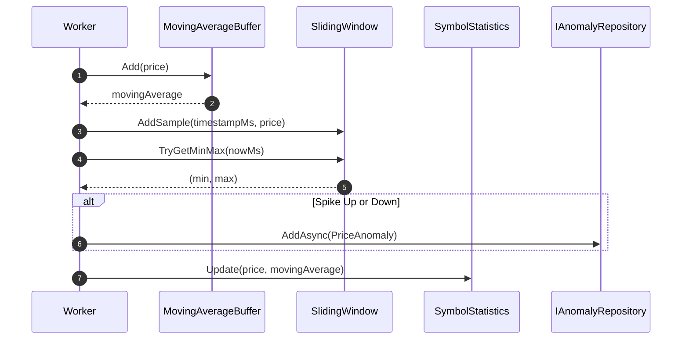

# MarketDataSystem – Performance & Scalability

This document explains how the system is designed to handle **high throughput** (10,000+ updates/sec)
and how it can scale on modern hardware.

---

## 1. Performance Goals

- Sustain **10k+ price updates per second** on a single node.
- Keep per-tick processing cost near **O(1)**.
- Avoid unnecessary allocations in the hot path.
- Scale with CPU cores via **partitioning**.

---

## 2. Throughput Strategy

### 2.1 Partitioned Channels + Workers

The core processing engine (`HighPerformanceMarketDataProcessorService`) uses:

- `Channel<PriceUpdate>[]` array, one channel per partition.
- One dedicated worker Task per partition.
- Each symbol is routed using:

```csharp
int hash = symbol.GetHashCode() & 0x7fffffff;
int partitionId = hash % partitionCount;
```

So:

- All updates for a symbol go to the **same partition**.
- That partition has a **single writer** to that symbol’s state.

### 2.2 Complexity Diagram

```mermaid
flowchart LR
    IN[Incoming Price Updates] --> RT[Router
(hash(symbol) % N)]
    RT --> P0[Partition 0
Channel + Worker]
    RT --> P1[Partition 1
Channel + Worker]
    RT --> P2[Partition 2
Channel + Worker]
    RT --> P3[Partition 3
Channel + Worker]

    P0 --> S0[SymbolState...]
    P1 --> S1[SymbolState...]
    P2 --> S2[SymbolState...]
    P3 --> S3[SymbolState...]
```

Each worker is responsible for:

- Dequeuing updates.
- Updating its `SymbolState`:
  - Moving average (O(1)).
  - Sliding window (O(1) amortized).
  - Symbol statistics (simple updates).
  - Anomaly detection (constant-time operations).

---

## 3. Data Structure Complexity

| Component              | Operation                       | Complexity | Notes                          |
|------------------------|----------------------------------|-----------:|--------------------------------|
| `MovingAverageBuffer`  | Add new price + compute average |    O(1)    | Ring buffer + running sum      |
| `SlidingWindow`        | Add sample + evict old          | ~ O(1)     | Monotonic deque (amortized)    |
| `SlidingWindow`        | Query min/max                   |    O(1)    | Head of deques                 |
| `SymbolStatistics`     | Update with new tick            |    O(1)    | Simple arithmetic              |
| Partition lookup       | Route symbol → partition        |    O(1)    | Hash modulus                   |
| Symbol lookup in dict  | Partition.symbols[symbol]       | ~ O(1)     | `ConcurrentDictionary`         |

Because everything is O(1) or amortized O(1), adding more ticks scales **linearly** with N (number of ticks),
rather than N².

---

## 4. Timeline of a Single Tick

```mermaid
gantt
    dateFormat  X
    axisFormat  %L

    section API Layer
    HTTP Request Handling      :done, 0, 3
    Model Binding & Validation :done, 3, 7

    section Application Layer
    MediatR Dispatch           :done, 7, 9
    Command Handler Mapping    :done, 9, 12

    section Infrastructure – Producer
    Enqueue to Channel         :done, 12, 15

    section Infrastructure – Consumer
    Dequeue in Worker          :done, 15, 20
    MovingAverageBuffer Update :done, 20, 22
    SlidingWindow Update       :done, 22, 25
    Anomaly Detection          :done, 25, 29
    SymbolStatistics Update    :done, 29, 33
```



Numbers are illustrative. The important part is **relative ordering**, not absolute ms.

---

## 5. Scaling with CPU Cores

### 5.1 Configuration

`MarketDataProcessingOptions` includes:

- `Partitions`: number of worker partitions.

If `Partitions = 0`, it defaults to `Environment.ProcessorCount`.

### 5.2 Scaling Behavior

- On a machine with N logical cores, setting `Partitions = N` gives each partition a “fair share” of CPU.
- For I/O-bound or mixed workloads, fewer partitions might suffice.
- For heavy workloads, you can:
  - Increase `Partitions` slightly above core count to account for blocking operations.
  - Or keep it equal and tune elsewhere.

### 5.3 Horizontal Scaling

For **multi-node** scenarios:

- Each node can run this service.
- A higher-level routing layer (e.g., a gateway or message bus) can shard symbols across nodes.
- Inside each node, partitions further spread work across cores.

---

## 6. Backpressure & Stability

### 6.1 Bounded Channels

Each partition uses a **bounded** channel with capacity:

- Configured via `ChannelCapacity` (e.g., 100,000).

Full mode:

- `DropOldest` – under overload, old ticks are dropped.

### 6.2 Why This Matters

Without bounds, a sudden burst could:

- Use unbounded memory.
- Cause GC pressure and slow everything down.

With bounds:

- The system **sheds load** gracefully.
- Latest data is preferred over old data.

---

## 7. GC & Allocation Considerations

- `MovingAverageBuffer` and `SlidingWindow` allocate once at construction.
- Each `SymbolState` allocates its buffers once when the symbol first appears.
- The hot path avoids:
  - LINQ allocations.
  - Boxing/unboxing.
  - Creating short-lived collections.

This keeps **GC pauses** minimized and **latency jitter** lower.

---

## 8. Load Testing Approach

Even if the repo does not contain a full load-test suite, the design anticipates it.

### 8.1 Scenario

- Run `SimulatedMarketDataFeedHostedService` with:
  - `TicksPerSecond` = 5000–20000.
  - Several symbols (e.g., 5–50).
- Alternatively, use an external tool (NBomber, K6, JMeter) to:
  - Call `POST /api/prices` at high rate.
  - Measure latency and server CPU/memory.

### 8.2 Observing Metrics

Use `GET /api/metrics` to observe:

- `totalProcessedTicks`
- `anomaliesDetected`
- `activeSymbols`
- `queueSize`

over time, e.g., every few seconds.

You can record these metrics and visualize them in a chart during a demo/interview.

---

## 9. Summary

- Partitioned workers + O(1) structures keep the system fast and predictable.
- Bounded channels prevent overload from turning into an outage.
- Options allow tuning for different environments and hardware.
- The design can be reasonably extended to multi-node deployments.

For more details on the internals, see:

- `ARCHITECTURE-COMBINED.md`
- `DESIGN_DECISIONS.md`


---

## 10. Micro-View of Tick Processing Cost



This emphasizes how each tick flows through micro-components in **constant time**.
