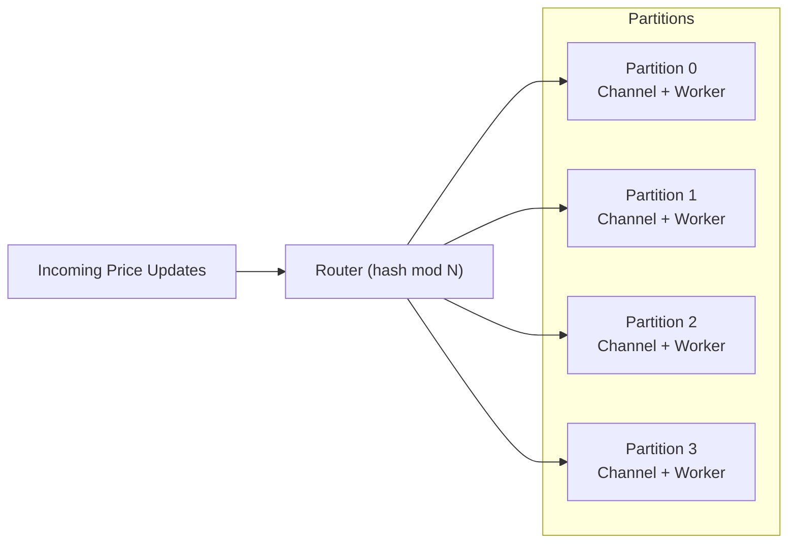
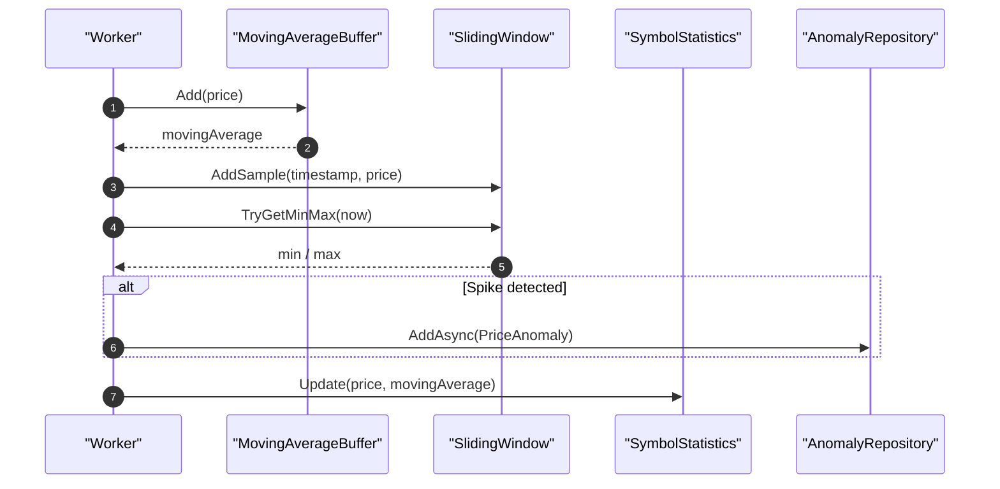

# MarketDataSystem – Performance & Scalability

This document explains how the system is designed to handle **high throughput** (10,000+ updates/sec)
and how it can scale on modern hardware.

---

## 1. Partitioned Processing

All updates for a given symbol go to the **same partition**, which owns that symbol's state.

---

## 2. Data Structure Complexity

| Component              | Operation                       | Complexity | Notes                          |
|------------------------|----------------------------------|-----------:|--------------------------------|
| `MovingAverageBuffer`  | Add new price + compute average |    O(1)    | Ring buffer + running sum      |
| `SlidingWindow`        | Add sample + evict old          | ~ O(1)     | Monotonic deque (amortized)    |
| `SlidingWindow`        | Query min/max                   |    O(1)    | Peek head of deques            |
| `SymbolStatistics`     | Update                          |    O(1)    | Simple arithmetic              |
| Partition routing      | Symbol → partition              |    O(1)    | Hash modulus                   |

---

## 3. Micro Tick Processing Flow

---

## 4. Summary

- Partitioned workers utilize CPU cores effectively.
- All hot-path operations are O(1) or amortized O(1).
- Bounded channels provide backpressure and prevent memory explosions.
