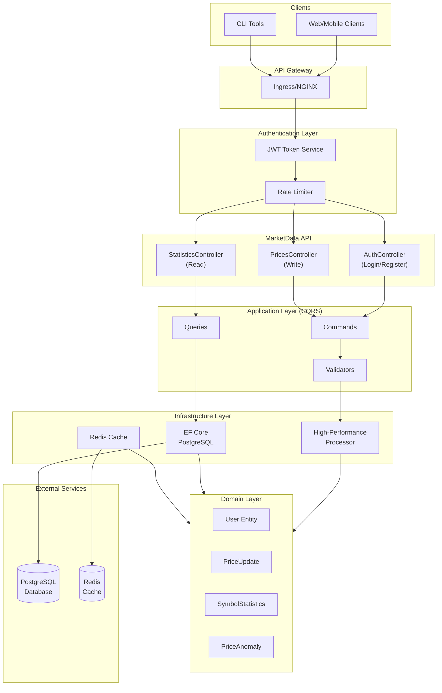

# MarketDataSystem – Documentation Index

This folder contains the **complete documentation** for the MarketDataSystem - a production-ready, enterprise-grade real-time market data processing system.

---

## 🆕 What's New (Latest Update: 2025-11-06)

The system has been upgraded to a **complete, production-ready implementation** with:

- ✅ **JWT Authentication & Authorization** - Complete security system
- ✅ **Database Persistence** - EF Core with PostgreSQL
- ✅ **Redis Caching** - Distributed caching
- ✅ **Rate Limiting** - API protection
- ✅ **CI/CD Pipelines** - Automated testing and deployment
- ✅ **Kubernetes & Helm** - Container orchestration
- ✅ **Terraform** - Infrastructure as Code
- ✅ **30+ Unit Tests** - Comprehensive coverage
- ✅ **10+ Integration Tests** - End-to-end testing

---

##  Documentation Structure

###  Core Architecture

| Document | Description |
|----------|-------------|
| **[ARCHITECTURE.md](ARCHITECTURE.md)** | System architecture, design patterns, component interactions |
| **[ARCHITECTURE-COMBINED.md](ARCHITECTURE-COMBINED.md)** | Consolidated architecture with all diagrams |
| **[DESIGN_DECISIONS.md](DESIGN_DECISIONS.md)** | Architectural decisions, trade-offs, rationale |

### Authentication & Security

| Document | Description |
|----------|-------------|
| **[AUTHENTICATION.md](AUTHENTICATION.md)** | 🆕 JWT authentication, authorization, user roles, security |
| **[SECURITY_TESTING.md](SECURITY_TESTING.md)** | Security considerations and testing strategies |

###  Database & Storage

| Document | Description |
|----------|-------------|
| **[DATABASE.md](DATABASE.md)** | 🆕 Database schema, EF Core, migrations, repositories |
| **[CONFIGURATION.md](CONFIGURATION.md)** | 🆕 Configuration reference for all environments |

###  API & Integration

| Document | Description |
|----------|-------------|
| **[API.md](API.md)** | 🆕 Complete HTTP API reference with auth endpoints |
| **[SIMULATION_GUIDE.md](SIMULATION_GUIDE.md)** | Simulated market data feed guide |

###  Deployment & Operations

| Document | Description |
|----------|-------------|
| **[CI_CD.md](CI_CD.md)** | 🆕 GitHub Actions workflows, pipelines, deployment |
| **[KUBERNETES.md](KUBERNETES.md)** | 🆕 Kubernetes deployment, Helm, scaling, monitoring |
| **[../DEPLOYMENT.md](../DEPLOYMENT.md)** | 🆕 Complete deployment guide (Docker, K8s, Terraform) |
| **[OPERATIONS_RUNBOOK.md](OPERATIONS_RUNBOOK.md)** | Operations guide, troubleshooting, monitoring |

###  Testing & Quality

| Document | Description |
|----------|-------------|
| **[TESTING_STRATEGY.md](TESTING_STRATEGY.md)** | 🆕 Testing approach with 30+ unit tests, 10+ integration tests |
| **[CODE_REVIEW.md](CODE_REVIEW.md)** | Code review checklist and guidelines |

###  Performance & Optimization

| Document | Description |
|----------|-------------|
| **[PERFORMANCE.md](PERFORMANCE.md)** | Performance metrics, benchmarks, optimization |

###  Reference

| Document | Description |
|----------|-------------|
| **[GLOSSARY.md](GLOSSARY.md)** | Terminology and definitions |
| **[LIMITATIONS_AND_FUTURE_WORK.md](LIMITATIONS_AND_FUTURE_WORK.md)** | Known limitations and future roadmap |
| **[INTERVIEW_QA.md](INTERVIEW_QA.md)** | Interview questions and detailed answers |

---

##  Quick Start Guide

### For Developers
1. Start with **[ARCHITECTURE.md](ARCHITECTURE.md)** - Understand the system design
2. Read **[API.md](API.md)** - Learn the API endpoints
3. Review **[AUTHENTICATION.md](AUTHENTICATION.md)** - Understand security
4. Check **[TESTING_STRATEGY.md](TESTING_STRATEGY.md)** - Learn testing approach

### For DevOps Engineers
1. Read **[DEPLOYMENT.md](../DEPLOYMENT.md)** - Complete deployment guide
2. Study **[KUBERNETES.md](KUBERNETES.md)** - Kubernetes setup
3. Review **[CI_CD.md](CI_CD.md)** - Pipeline configuration
4. Check **[OPERATIONS_RUNBOOK.md](OPERATIONS_RUNBOOK.md)** - Operations guide

### For Security Reviewers
1. Start with **[AUTHENTICATION.md](AUTHENTICATION.md)** - Auth implementation
2. Read **[SECURITY_TESTING.md](SECURITY_TESTING.md)** - Security testing
3. Review **[API.md](API.md)** - Endpoint security
4. Check **[CONFIGURATION.md](CONFIGURATION.md)** - Secure configuration

### For Interviewers/Reviewers
1. Read **[INTERVIEW_QA.md](INTERVIEW_QA.md)** - Q&A about design decisions
2. Review **[ARCHITECTURE-COMBINED.md](ARCHITECTURE-COMBINED.md)** - Complete architecture
3. Check **[DESIGN_DECISIONS.md](DESIGN_DECISIONS.md)** - Design rationale
4. Study **[PERFORMANCE.md](PERFORMANCE.md)** - Performance characteristics

---

##  System Architecture (Updated)

---

##  Key Features

### Production-Ready Features
- **Authentication**: JWT-based with refresh tokens
- **Authorization**: Role-based and policy-based access control
- **Rate Limiting**: Configurable per endpoint
- **Caching**: Distributed Redis caching
- **Database**: PostgreSQL with EF Core
- **Testing**: 30+ unit tests, 10+ integration tests
- **CI/CD**: Complete GitHub Actions workflows
- **Deployment**: Docker, Kubernetes, Helm, Terraform
- **Monitoring**: Health checks, logging, metrics
- **Documentation**: Complete, up-to-date documentation

### Technical Highlights
- **High Performance**: 2000+ ticks/second processing
- **Scalable**: Horizontal pod autoscaling (2-10 replicas)
- **Secure**: BCrypt password hashing, JWT tokens, HTTPS
- **Observable**: Structured logging, health checks, metrics
- **Maintainable**: Clean Architecture, CQRS, repository pattern
- **Testable**: Comprehensive unit and integration tests

---

##  Project Statistics

- **Total Documentation Files**: 18
- **Lines of Code**: ~5,000+
- **Test Coverage**: 30+ unit tests, 10+ integration tests
- **CI/CD Workflows**: 5 (build, test, docker, quality, deploy)
- **Kubernetes Resources**: 7 (deployment, service, ingress, configmap, secret, hpa)
- **Helm Chart**: Complete with dependencies
- **Terraform Modules**: Azure infrastructure (AKS, PostgreSQL, Redis, ACR)

---

##  Recent Changes

### Version 1.0.0 (2025-11-06)

**Major Features Added:**
- Complete JWT authentication and authorization system
- Database persistence with EF Core and PostgreSQL
- Redis distributed caching
- Rate limiting with AspNetCoreRateLimit
- 30+ comprehensive unit tests
- 10+ end-to-end integration tests
- Complete CI/CD pipelines with GitHub Actions
- Full Kubernetes deployment with Helm charts
- Terraform infrastructure for Azure
- Environment-specific configuration
- Complete documentation update

**API Changes:**
- Added `/api/auth/*` endpoints for authentication
- All endpoints (except auth) now require authentication
- Added JWT bearer token support to Swagger

**Breaking Changes:**
- Authentication now required for all data endpoints
- Configuration structure updated with new sections

See [DEPLOYMENT.md](../DEPLOYMENT.md) for migration guide.

---

##  Learning Path

### Beginner
1. Read **[README.md](../README.md)** in root folder
2. Study **[ARCHITECTURE.md](ARCHITECTURE.md)**
3. Try **[SIMULATION_GUIDE.md](SIMULATION_GUIDE.md)**

### Intermediate
1. Deep dive into **[ARCHITECTURE-COMBINED.md](ARCHITECTURE-COMBINED.md)**
2. Understand **[AUTHENTICATION.md](AUTHENTICATION.md)**
3. Learn **[DATABASE.md](DATABASE.md)**
4. Practice with **[API.md](API.md)**

### Advanced
1. Master **[PERFORMANCE.md](PERFORMANCE.md)**
2. Study **[KUBERNETES.md](KUBERNETES.md)**
3. Review **[CI_CD.md](CI_CD.md)**
4. Understand **[DESIGN_DECISIONS.md](DESIGN_DECISIONS.md)**

---

##  Contributing

When contributing to documentation:

1. Keep documentation synchronized with code
2. Update this index when adding new docs
3. Follow markdown best practices
4. Include code examples where appropriate
5. Add diagrams for complex concepts
6. Update the "Last Updated" date

---

##  Support

For questions or clarifications:
- GitHub Issues: https://github.com/yasserebrahimi/MarketDataSystem/issues
- Email: yasser.ebrahimi@outlook.com

---

##  Document Status

| Status | Description |
|--------|-------------|
| ✅ Up-to-date | Current with latest codebase (v1.0.0) |
| 🆕 New | Recently added |
| 📝 In Progress | Being updated |

All documents marked with 🆕 or status "Up-to-date" reflect the latest production-ready implementation.

---

**Last Updated:** 2025-11-06
**Version:** 1.0.0
**Status:** ✅ Production Ready
