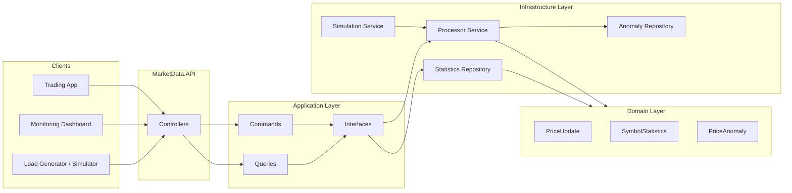

# MarketDataSystem – Documentation Index

This folder contains the **full documentation set** for the MarketDataSystem project.

The goal is to make the system **fully understandable** for reviewers, interviewers, and future contributors.

---

## Documents Overview

| File                             | Purpose                                                           |
|----------------------------------|-------------------------------------------------------------------|
| `README_DOCS.md`                 | This index.                                                       |
| `ARCHITECTURE-COMBINED.md`       | Full architecture deep-dive with diagrams.                       |
| `INTERVIEW_QA.md`                | Interview-style Q&A.                                              |
| `API.md`                         | HTTP API reference.                                               |
| `DESIGN_DECISIONS.md`            | Key architectural decisions and rationale.                        |
| `PERFORMANCE.md`                 | Performance characteristics and scaling model.                    |
| `TESTING_STRATEGY.md`            | Testing approach at different levels.                             |
| `OPERATIONS_RUNBOOK.md`          | Operational guide for running and troubleshooting.                |
| `SIMULATION_GUIDE.md`            | How the simulated market feed works and how to use it.            |
| `LIMITATIONS_AND_FUTURE_WORK.md` | Known limitations and future roadmap.                             |
| `GLOSSARY.md`                    | Definitions of important terms used throughout the project.       |
| `CODE_REVIEW.md`                 | Code review notes.                                                |
| `SECURITY_TESTING.md`            | Security testing plan and considerations.                         |

---

## Big Picture Diagram

Use this file as your **starting point**: follow the links to dive into specific topics.
