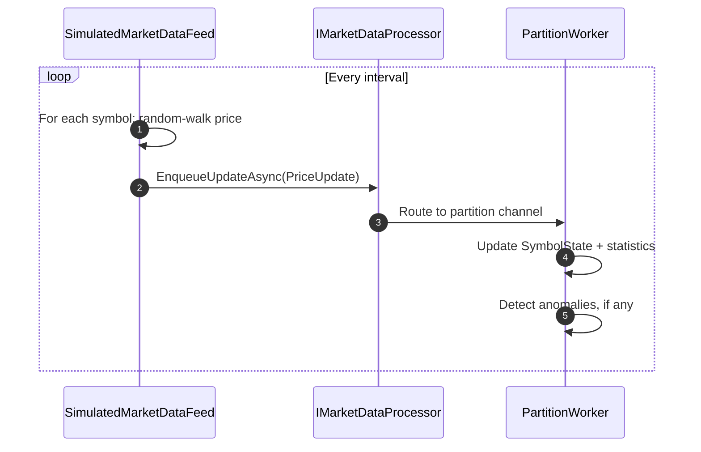
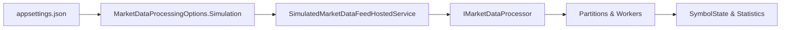

# MarketDataSystem – Simulation Guide

This document explains how the **simulated market data feed** works and how to use it
for demos, debugging, and basic load testing.

---

## 1. Why a Simulation Feed?

The assignment requires:

> Simulate the feed with random price updates for multiple symbols.

Instead of relying on a real exchange or external dependency, we implement:

- `SimulatedMarketDataFeedHostedService` – a background service that:
  - Generates a **random-walk** price series for a set of symbols.
  - Feeds these prices into `IMarketDataProcessor` at a configurable rate.

This makes it easy to:

- Demo the system live (without any external data).
- Stress the processor with a controlled load.
- Observe anomaly detection in action.

---

## 2. Configuration

The feed is controlled via `MarketDataProcessingOptions.Simulation`, typically in `appsettings.json`:

```json
{
  "MarketDataProcessing": {
    "Simulation": {
      "Enabled": true,
      "Symbols": ["AAPL","GOOG","MSFT","EURUSD","BTCUSD"],
      "TicksPerSecond": 2000,
      "InitialPrice": 100.0,
      "MaxJitterPercent": 0.01
    }
  }
}
```

| Field             | Type      | Description                                                     |
|-------------------|-----------|-----------------------------------------------------------------|
| `Enabled`         | bool      | Turn the simulation on/off.                                     |
| `Symbols`         | string[]  | Symbols for which prices will be generated.                     |
| `TicksPerSecond`  | int       | Approximate number of price updates per second (total).         |
| `InitialPrice`    | decimal   | Starting price for all symbols.                                 |
| `MaxJitterPercent`| decimal   | Max random percentage (+/-) change per tick (random walk).      |

---

## 3. How the Simulation Works

### 3.1 Random Walk Model

For each symbol:

- Maintain a `decimal` current price.
- At each iteration, generate a **jitter** in range `[-MaxJitterPercent, +MaxJitterPercent]`.
- New price = `currentPrice * (1 + jitter)`.
- If new price <= 0, fall back to old price.

### 3.2 Frequency

An interval is calculated as:

- `intervalMs = 1000.0 / TicksPerSecond`

Then the loop:

1. Gets current timestamp (UTC).
2. For each symbol:
   - Compute new price.
   - Create a `PriceUpdate(symbol, newPrice, timestamp)`.
   - Call `IMarketDataProcessor.EnqueueUpdateAsync(update)`.
3. `await Task.Delay(intervalMs)` (respecting cancellation token).

### 3.3 Sequence Diagram



---

## 4. Typical Scenarios

### 4.1 Demo Mode

Goal:

- Show the system to someone quickly.

Steps:

1. Ensure simulation is enabled (`Enabled: true`).
2. Run the API (`dotnet run`).
3. Open:
   - Swagger UI.
   - `/api/prices` – observe symbols and stats.
   - `/api/anomalies` – see anomalies appearing over time.
   - `/api/metrics` – watch counts increase.

### 4.2 Local Stress Test

Goal:

- Evaluate how the system behaves under load.

Steps:

1. Increase `TicksPerSecond` (e.g., 5000, 10000, or more).
2. Optionally increase number of `Symbols`.
3. Run service and observe:
   - CPU usage.
   - `/api/metrics` for `totalProcessedTicks`, `queueSize`.
4. Tune:
   - `Partitions` (more workers).
   - `ChannelCapacity`.

---

## 5. Disabling the Simulation

In a real environment (e.g., production), you most likely want to:

- Set `Simulation.Enabled = false`.

This will:

- Skip starting `SimulatedMarketDataFeedHostedService`.
- Allow you to feed real data (e.g., from external source, message bus, or real exchange).

---

## 6. Integration with Real Feeds

The same `IMarketDataProcessor` interface can be used by:

- Simulation feed (this service).
- Real market data feed adapters (WebSockets, Kafka consumer, etc.).

This keeps ingestion logic consistent:

- All feeds produce `PriceUpdate` instances.
- All feeds use `IMarketDataProcessor.EnqueueUpdateAsync`.

---

## 7. Summary

The simulation layer is:

- **Optional**, but very helpful for demos and local experiments.
- Configurable for rate, symbols, and volatility.
- A clean example of how to integrate additional producers with the processing engine.


---

## 8. Simulation Configuration Flow



This shows how a change in configuration flows down to affect the simulation behavior and, ultimately, the statistics seen by API clients.
