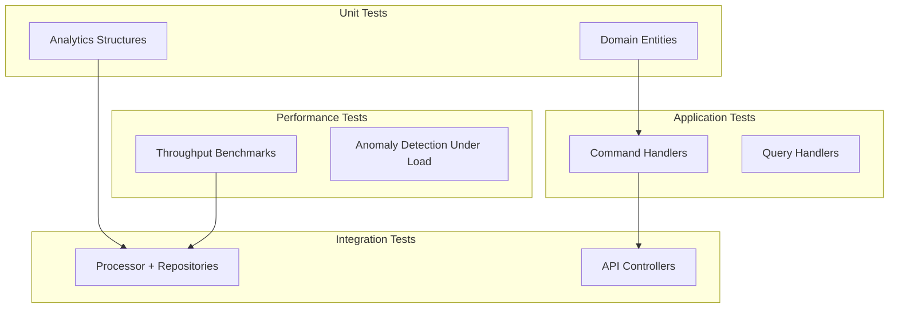

# MarketDataSystem – Testing Strategy

This document describes **how to test** the system at different levels:

- Unit tests
- Integration tests
- End-to-end (E2E) tests
- Load / performance tests

Even if the repository does not include a full test suite yet, the design makes adding tests straightforward.

---

## 1. Testing Overview



---

## 2. Unit Tests

### 2.1 Domain

Target:

- `PriceUpdate` – value semantics, factory methods.
- `SymbolStatistics` – correctness of `Update` logic:
  - `currentPrice`
  - `movingAverage`
  - `updateCount`
  - `minPrice` / `maxPrice`

Example checks:

- Starting from a fresh `SymbolStatistics`, apply known sequence of updates and assert on result.
- Validate behavior around boundaries (e.g., first update sets min/max to same value).

### 2.2 Analytics

Target:

- `MovingAverageBuffer`
- `SlidingWindow` (with monotonic deques)

Example tests:

- For `MovingAverageBuffer`:
  - Add sequence `[1, 2, 3, 4]` with capacity 3:
    - After 1: avg = 1
    - After 2: avg = 1.5
    - After 3: avg = 2
    - After 4: we drop `1` (oldest) and avg = (2+3+4)/3 = 3

- For `SlidingWindow`:
  - Use synthetic timestamps (e.g., 0, 200, 400, 1200, 1400 ms) and assert that:
    - Samples older than window are evicted.
    - Min/max reflect only current window.

---

## 3. Application Tests

Target:

- `ProcessPriceUpdateCommandHandler`
- `GetSymbolStatisticsQueryHandler`
- `GetAllStatisticsQueryHandler`
- `GetRecentAnomaliesQueryHandler`

Approach:

- Use **mocked interfaces**:
  - Mock `IMarketDataProcessor`, `IStatisticsRepository`, `IAnomalyRepository`.
- Assert:
  - Correct methods are called with correct parameters.
  - Handlers map domain objects to DTOs correctly.
  - Error paths (e.g., null statistics) map to expected behavior.

Example:

- For `GetSymbolStatisticsQueryHandler`:
  - Arrange: `IStatisticsRepository.GetBySymbolAsync` returns a known `SymbolStatistics`.
  - Act: handler returns DTO.
  - Assert: DTO fields match expectations.

---

## 4. Integration Tests

### 4.1 Processor + Repository

Goal:

- Validate that `HighPerformanceMarketDataProcessorService` and `InMemoryStatisticsRepository` work end-to-end.

Example test:

1. Instantiate the processor with a small configuration.
2. Start its workers (or run `WorkerLoopAsync` in a controlled way).
3. Enqueue a series of `PriceUpdate`s for a few symbols.
4. After a short delay, query `InMemoryStatisticsRepository`:
   - Check `updateCount`, `movingAverage`, `lastUpdateTime`.
   - Optionally check for anomalies.

This ensures:

- Channel routing works.
- Per-symbol state is updated.
- Repository exposes snapshots correctly.

### 4.2 API Integration Tests

Use `WebApplicationFactory<TEntryPoint>` (from `Microsoft.AspNetCore.Mvc.Testing`):

- Spin up the real API in-memory.
- Send HTTP requests:
  - `POST /api/prices`
  - `GET /api/prices/{symbol}`
  - `GET /api/anomalies`
  - `GET /api/metrics`
- Assert on HTTP status codes and JSON responses.

This validates:

- Routing and controllers.
- Model binding and validation.
- Wiring of DI (processor + repositories).

---

## 5. Load / Performance Tests

Tools (examples):

- **NBomber** (C#-native)
- **K6**, **JMeter**, or similar

### 5.1 Simulated Feed

Because the system includes `SimulatedMarketDataFeedHostedService`, you can:

- Run service with simulation enabled.
- Observe metrics via `/api/metrics`.
- Use external tools mostly for **read-path** (e.g., frequent `GET /api/prices`).

### 5.2 External Load

Alternatively:

- Use NBomber/K6 to send `POST /api/prices` at high rate.
- Measure:
  - Request latency.
  - Errors (e.g., timeouts).
- Correlate with `/api/metrics` to see actual processed tick rate.

---

## 6. Testing Matrix

| Layer         | What to Test                               | Type          |
|---------------|--------------------------------------------|---------------|
| Domain        | Entities & value logic                     | Unit          |
| Analytics     | MovingAverageBuffer, SlidingWindow         | Unit          |
| Application   | Each handler (commands/queries)            | Unit          |
| Infrastructure| Processor + in-memory repositories         | Integration   |
| API           | Endpoints, model binding, status codes     | Integration   |
| System        | Combined behavior under synthetic load     | E2E / Load    |

---

## 7. Summary

The architecture is deliberately designed to make testing easy:

- Stateless functions and simple entities in Domain/Analytics.
- Interfaces in Application for mocking.
- Clear boundaries between API and processing core.

Adding tests in this structure is incremental: you can start small (pure unit tests) and gradually build up to full load testing as needed.


---

## 8. Test Pyramid Visualization

```mermaid
graph TD
    U[Unit Tests
(Domain, Analytics)] --> A[Application Tests
(Handlers)]
    A --> I[Integration Tests
(Processor, API)]
    I --> P[Performance & Load Tests]

    style U fill:#e0ffe0,stroke:#00aa00,stroke-width:1px
    style A fill:#e0f0ff,stroke:#0066cc,stroke-width:1px
    style I fill:#fff4e0,stroke:#ff9900,stroke-width:1px
    style P fill:#ffe0e0,stroke:#cc0000,stroke-width:1px
```

The idea:

- **Most** tests should be small and fast (Unit).
- Fewer but meaningful Application and Integration tests.
- A smaller number of expensive performance/load tests.
