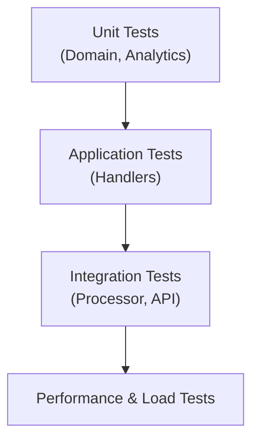

# MarketDataSystem – Testing Strategy

This document describes **how to test** the system at different levels:

- Unit tests
- Integration tests
- End-to-end (E2E) tests
- Load / performance tests

---

## 1. Testing Layers

| Layer         | What to Test                               | Type        |
|---------------|--------------------------------------------|-------------|
| Domain        | Entities & value logic                     | Unit        |
| Analytics     | MovingAverageBuffer, SlidingWindow         | Unit        |
| Application   | Command and query handlers                 | Unit        |
| Infrastructure| Processor + in-memory repositories         | Integration |
| API           | Endpoints, model binding, status codes     | Integration |
| System        | Combined behavior under synthetic load     | E2E / Load  |

---

## 2. Test Pyramid Visualization

The idea:

- Most tests should be small and fast (Unit).
- Fewer but meaningful Application and Integration tests.
- A smaller number of expensive performance/load tests.

---

Additional details on scenarios and tools can be found in the rest of this file or in related docs (`PERFORMANCE.md`, `OPERATIONS_RUNBOOK.md`).
